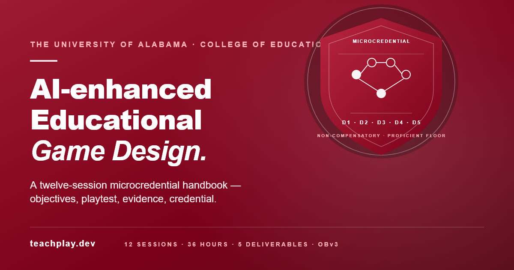
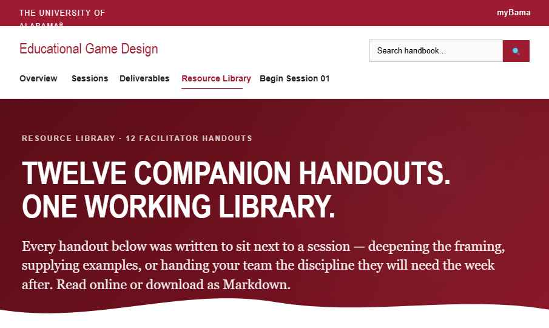
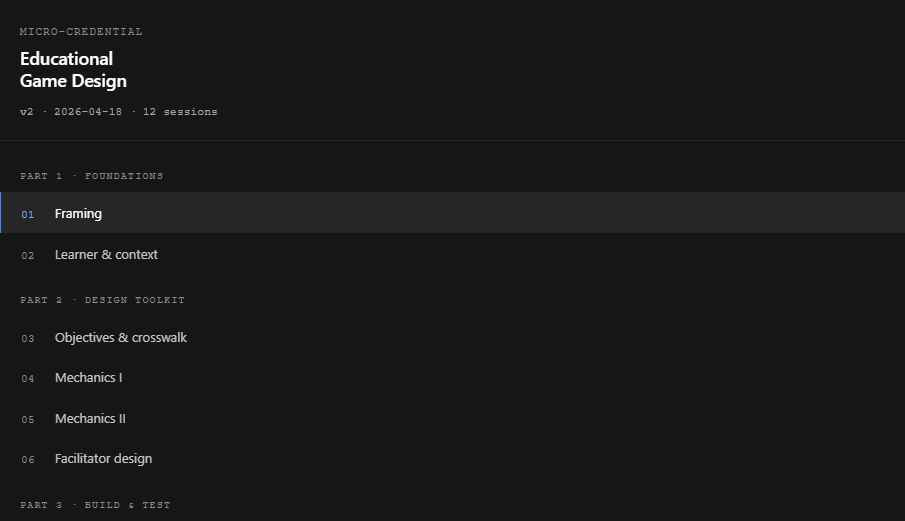
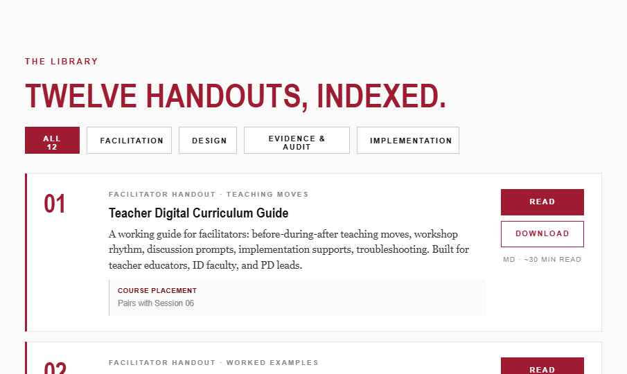
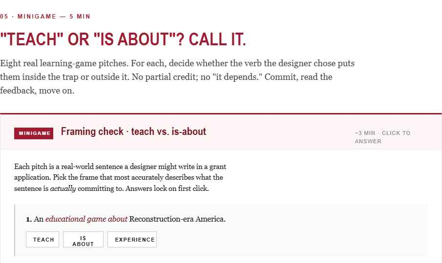
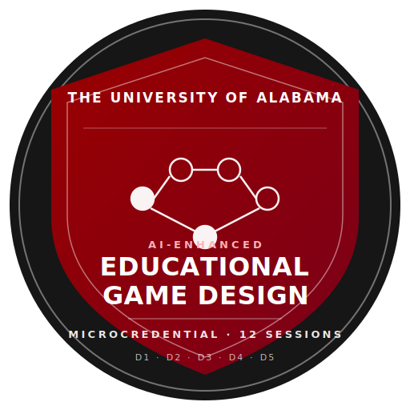

<p align="center">
  <a href="https://teachplay.dev/">
    
  </a>
</p>

<h1 align="center">AI-enhanced Educational Game Design</h1>

<p align="center">
  A twelve-session microcredential handbook —<br/>
  <em>objectives, playtest, evidence, credential.</em>
</p>

<p align="center">
  <a href="https://teachplay.dev/"></a>
  
  
  
  
  
  
  
  
</p>

<p align="center">
  <a href="#what-it-is">What it is</a> ·
  <a href="#in-the-handbook">In the handbook</a> ·
  <a href="#technical-niches">Technical niches</a> ·
  <a href="#architecture">Architecture</a> ·
  <a href="#quick-start">Quick start</a> ·
  <a href="#design-notes">Design notes</a>
</p>

---

## What it is

A self-contained, static handbook for The University of Alabama's *AI-enhanced Educational Game Design* microcredential (v2). Twelve weekly sessions, each pairing one learning objective with one designed artifact. Five non-compensatory deliverables, 25 rubric criteria, one Proficient floor.

The repository is also a **reference implementation** of a credential stack — Open Badges 3.0 / W3C Verifiable Credentials 2.0 / CLR 2.0 / xAPI — so the same scaffolding can be lifted into other competency-based programs without re-deriving the spec choices.

---

## In the handbook

<table>
  <tr>
    <td width="50%">
      <a href="https://teachplay.dev/"></a>
      <p align="center"><sub><strong>The front of the house.</strong> Crimson-branded hero, 12-session grid, and a Resource Library entry — one handout per session.</sub></p>
    </td>
    <td width="50%">
      
      <p align="center"><sub><strong>The left rail.</strong> Four parts, twelve sessions, live progress counter (<code>hb:done</code> in <code>localStorage</code>).</sub></p>
    </td>
  </tr>
  <tr>
    <td width="50%">
      
      <p align="center"><sub><strong>The companion library.</strong> Twelve facilitator handouts, indexed and filtered by course placement.</sub></p>
    </td>
    <td width="50%">
      
      <p align="center"><sub><strong>Embedded minigames.</strong> Each session ships an interactive check-for-understanding — answers lock on first click, no partial credit.</sub></p>
    </td>
  </tr>
</table>

---

## Technical niches

Specifications chosen on purpose. Each one does work the next one cannot.

<table>
  <tr>
    <td width="33%" valign="top">
      <h3>Open Badges 3.0 + VC 2.0</h3>
      <p>Assertions conform to <code>OpenBadgeCredential</code> on a <code>VerifiableCredential</code> base. Data Integrity Proof placeholders are ready for <code>eddsa-rdfc-2022</code> / Ed25519 signing; issuer binds to a <code>did:web</code> path so proofs verify without contacting us.</p>
      <p><em>See <a href="credential/badge-class-v3.json"><code>credential/badge-class-v3.json</code></a>, <a href="credential/assertion-example-v3.json"><code>assertion-example-v3.json</code></a>.</em></p>
    </td>
    <td width="33%" valign="top">
      <h3>ESCO + Lightcast crosswalk</h3>
      <p>All 25 rubric criteria are mapped to ESCO v1.1.1 and Lightcast Open Skills URIs. The badge's <code>alignment[]</code> block reads machine-verifiably against the same taxonomies state workforce agencies and LER-RS pipelines consume.</p>
      <p><em>See <a href="credential/skills-crosswalk.json"><code>credential/skills-crosswalk.json</code></a>, <a href="alignment.html"><code>alignment.html</code></a>.</em></p>
    </td>
    <td width="33%" valign="top">
      <h3>CLR 2.0 portfolio export</h3>
      <p>Whole-portfolio transcripts as a <code>ClrCredential</code>, with per-deliverable <code>achievement</code> blocks and an embedded <code>_xapi_statements</code> array so cohort context travels with the artifact. Cohort or per-learner export from <code>analytics.html</code>.</p>
      <p><em>See <a href="clr.js"><code>clr.js</code></a>.</em></p>
    </td>
  </tr>
  <tr>
    <td valign="top">
      <h3>xAPI 1.0.3 analytics</h3>
      <p>Cohort heatmap, completion funnel, Cohen's κ inter-rater reliability, and a pre/post eight-skill self-assessment stream with growth deltas — rendered against the same taxonomy the badge alignment uses.</p>
      <p><em>See <a href="xapi.js"><code>xapi.js</code></a>, <a href="analytics.html"><code>analytics.html</code></a>.</em></p>
    </td>
    <td valign="top">
      <h3>Non-compensatory rubric</h3>
      <p>One Developing on any criterion blocks the deliverable. <code>scoreGiven</code> is binary (0 or 1); no partial credit buys over a floor. Double-rating on ≥ 20% of submissions feeds κ.</p>
      <p><em>See <a href="rubrics.html"><code>rubrics.html</code></a>, <a href="docs/L3-evaluation-plan.md"><code>docs/L3-evaluation-plan.md</code></a>.</em></p>
    </td>
    <td valign="top">
      <h3>Endorsement credentials</h3>
      <p>Third-party endorsers (external faculty, industry partners) sign their own <code>EndorsementCredential</code> against our BadgeClass — per-cohort or per-learner. The handbook stays the source of truth; the endorser contributes an orthogonal signal.</p>
      <p><em>See <a href="credential/endorsement-template-v3.json"><code>endorsement-template-v3.json</code></a>.</em></p>
    </td>
  </tr>
</table>

> **Design notes shipped alongside, not code.**
> LTI 1.3 production wiring, Credential Engine / CTDL registry submission, AI-assisted skill tagging (prompt template v0.3 with negative-space signal), and a Kirkpatrick × CIPP program-evaluation framework — see [`docs/`](docs/).

---

## Architecture

<p align="center">
  
</p>

**Deliberately boring stack.** Static HTML / CSS / vanilla JS, no build step for the shell, no server component, no user analytics. Hosted on Cloudflare Pages at [teachplay.dev](https://teachplay.dev/). Two interactive labs are self-contained SCORM packages under `minigames/`.

```
Learner browser                                        Issuer (durable URL)
────────────────                                       ─────────────────────
index.html → shell.js → localStorage                   teachplay.dev/credential/
   │                                                     ├── issuer-v3.json
   ├── xapi.js ──────── xAPI 1.0.3 statements          ├── badge-class-v3.json
   │                         (local queue)             ├── assertion-example-v3.json
   ├── analytics.html ── κ · funnel · heatmap          ├── endorsement-template-v3.json
   │                     · skills growth chart         └── skills-crosswalk.json
   ├── clr.js ───────── CLR 2.0 portfolio export                │
   └── role.js ──────── student / instructor surface           ▼
                                                        ESCO + Lightcast
                                                        (taxonomy refs)
```

---

## Quick start

```bash
# clone
git clone https://github.com/Educatian/TeachPlay.git
cd TeachPlay

# serve (any static server; python is zero-dep)
python -m http.server 8099
```

Open [http://localhost:8099/](http://localhost:8099/). The preview launch config at `.claude/launch.json` starts the same server for in-editor preview.

**To deploy your own instance**: push to a fork, connect the fork to Cloudflare Pages (or any static host), and rewrite the canonical URL references in `credential/*.json` and the xAPI extension IRIs to your domain.

---

## Repository map

```
index.html              Landing: hero, sessions grid, deliverables
session-01.html …       12 session pages — one LO, one artifact each
  session-12.html
rubrics.html            25-criterion rubric, non-compensatory, AI-tagging stub
alignment.html          Crosswalk: objectives ↔ deliverables ↔ skill chips
credential.html         Public credential page (OBv3, stacking, endorsement)
analytics.html          Instructor analytics — κ, funnel, skills growth
facilitator.html        Facilitator-only views
resources.html          Resource library + #labs section
read.html               Markdown viewer for companion handouts

handbook.css            Shared styles (inc. @media print)
shell.js                Sidebar, checklists, tickets, self-assessment wiring
xapi.js                 xAPI 1.0.3 emitter
clr.js                  CLR 2.0 export adapter
role.js                 Student ⇄ Instructor role toggle
minigames.js            Inline minigame injector

credential/             Open Badges + VC + endorsement + crosswalk (JSON-LD)
docs/                   Design notes — CTDL, AI tagging, LTI, evaluation
resources/              12 markdown handouts (companion library)
minigames/              SCORM labs — orbit-sum-lab, electric-circuit-lab
screenshots/            Handbook screenshots (used in this README)
og-image.svg / .png     Social preview card (1200 × 630)
```

---

## Credentials in detail

<details>
<summary><strong>What the badge means and how it's shaped</strong></summary>

- **Achievement type**: `Badge` with `creditsAvailable: 3`
- **Alignment block**: ISTE · UDL · NETP + ESCO + Lightcast — one per criterion (25 total)
- **Evidence**: `credentialSubject.result[]` carries one block per deliverable D1–D5 with rubric rollup
- **Proof placeholder**: `DataIntegrityProof` with `cryptosuite: eddsa-rdfc-2022`, proofPurpose `assertionMethod`
- **Dual publishing**: OBv2 (`credential/badge-class.json`) and OBv3 (`credential/badge-class-v3.json`) live side-by-side until consumers migrate

</details>

<details>
<summary><strong>Analytics that instructors actually use</strong></summary>

- **Cohort heatmap** — which rubric criteria get Developing calls most often
- **Completion funnel** — entered / attempted / completed / abandoned per session
- **Cohen's κ** — inter-rater reliability on double-rated deliverables, with calibration trigger at κ < 0.70
- **Skills growth** — pre/post 8-skill Likert delta per cohort, rendered as bars with Δ
- **CLR export** — whole-cohort or per-learner, as `ClrCredential` JSON

</details>

<details>
<summary><strong>Persistence and privacy</strong></summary>

All learner progress is stored in `localStorage` on the visitor's browser:

- `hb:s{n}:chk:{id}` — checklist item state per session
- `hb:s{n}:ticket:{id}` — exit-ticket textarea content
- `hb:done` — set of sessions marked complete
- `hb:self-assess:{pre|post}:{skill}` — 0–4 Likert self-ratings
- `hb:xapi:queue` — xAPI statement queue
- `hb:xapi:actor` — pseudonymous actor (UUID, browser-local)

No server component, no third-party analytics, no identifying data leaves the browser in the reference implementation. Clearing site data resets progress.

</details>

---

## Design notes

Under-building on purpose; each note names the decisions before any code ships.

| Note | What it covers |
| --- | --- |
| [`docs/L1-ai-skill-tagging-design.md`](docs/L1-ai-skill-tagging-design.md) | Prompt template (v0.3) for AI-assisted skill extraction. Evidence-linked tags, negative-space "claimed but not shown" signal, guardrails against over-reliance. |
| [`docs/L1-credential-engine-registration.md`](docs/L1-credential-engine-registration.md) | CTDL resources to publish (`ceterms:MicroCredential`, `ceasn:CompetencyFramework`, …), field-by-field mapping, submission workflow. |
| [`docs/L2-lti-1.3-design.md`](docs/L2-lti-1.3-design.md) | LTI 1.3 integration plan — OIDC launch, Assignment and Grade Services (AGS), Names and Role Provisioning (NRPS), role claim enforcement, estimated effort. |
| [`docs/L3-evaluation-plan.md`](docs/L3-evaluation-plan.md) | Program evaluation framework — Kirkpatrick × CIPP, EQ1–EQ5 (skill acquisition, inter-rater reliability, equity subgroups, transfer, external validity), IRB posture. |

---

## Session ↔ Lab pairings

| Session | Lab | Role |
| --- | --- | --- |
| S3 · Objectives and crosswalk | Orbit Sum Lab (SCORM, React/Vite) | Worked crosswalk case |
| S8 · Interaction spec | Electric Circuit Lab (SCORM, Three.js) | Reference implementation |
| S10 · Audit | both labs | Audit subjects — accessibility, QA, data |
| `resources.html#labs` | both labs | Library entry |

---

## Adding content

<details>
<summary><strong>Add a new handout</strong></summary>

1. Drop `resources/NN-slug.md` into the `resources/` folder.
2. Add a `.resource` card to the relevant session's Companion reading section with:
   - `href="read.html?doc=NN-slug.md"` on the Read button
   - `href="resources/NN-slug.md" download` on the Download button
3. Add a matching entry to the `resources.html` library grid.

</details>

<details>
<summary><strong>Add a new lab</strong></summary>

1. Unpack the SCORM package into `minigames/<slug>/`.
2. Pick the session whose learning objective the lab exemplifies.
3. Add a `.resource` card inside that session's `#reading` block — use the `A` (green) or `B` (blue) badge convention established in S3/S8/S10.
4. Also add a card to `resources.html#labs` so the library stays complete.

</details>

---

## Print / PDF

Each session page has a Print / PDF button. The print stylesheet at `handbook.css:1886` hides sidebar / toolbar / nav, expands content to full width, and avoids page breaks inside blocks.

---

## License and acknowledgments

The University of Alabama, College of Education. Non-compensatory rubric design informed by the competency-based assessment literature. Credential specifications draw on the 1EdTech Open Badges 3.0 / CLR 2.0 working groups, W3C Verifiable Credentials 2.0, Credential Engine's CTDL vocabulary, and the Digital Credentials Consortium's guidance on decentralized issuer binding.

<p align="center">
  <sub>Built slowly, on purpose.</sub>
</p>
