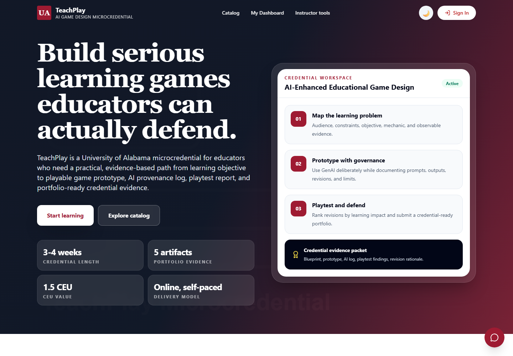
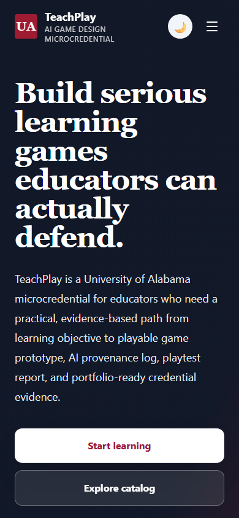
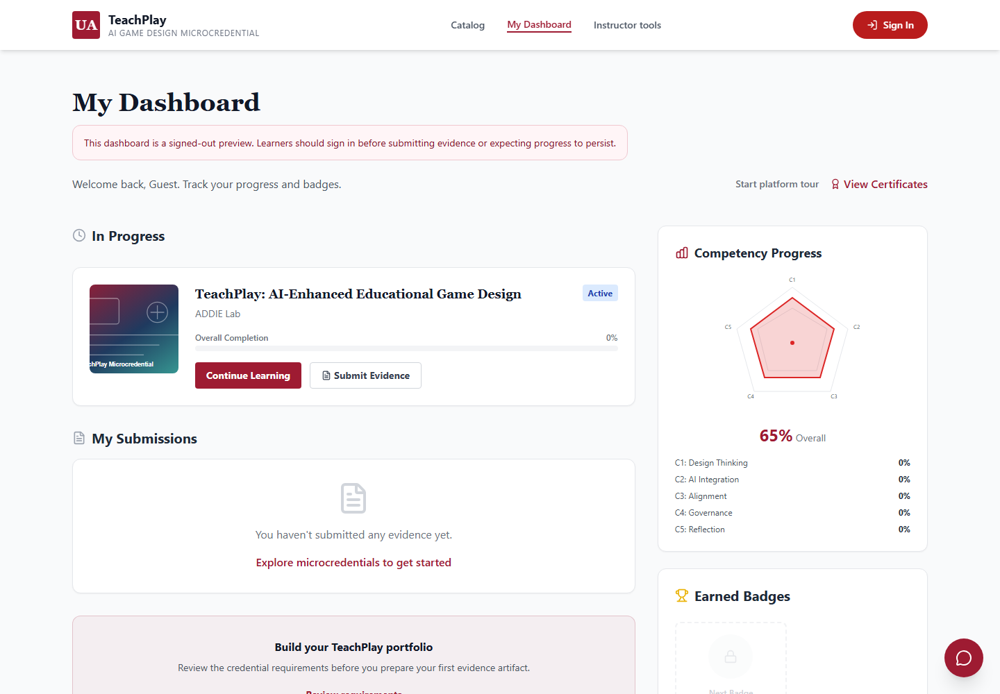
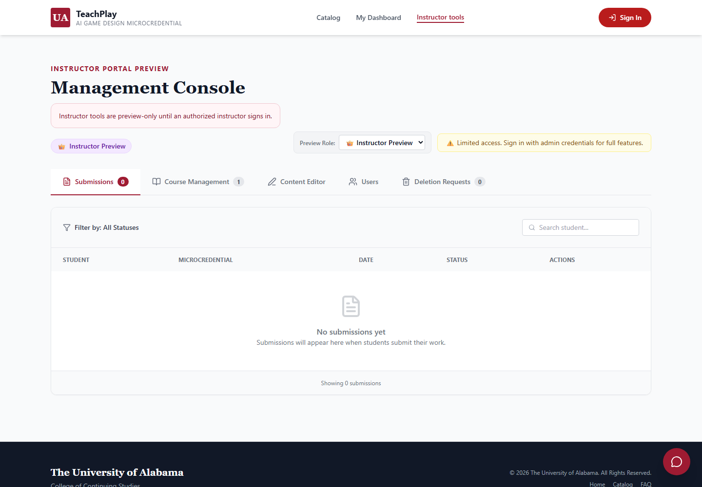

# TeachPlay Platform Screenshots

Updated screenshots captured from the unified TeachPlay learner platform.

## Platform Gallery

| View | Screenshot |
| --- | --- |
| Root learner workspace, desktop |  |
| Root learner workspace, mobile |  |
| Credential detail and learner access guide |  |
| Credential catalog |  |
| Signed-out learner dashboard preview |  |
| Instructor tools preview |  |

## Activity And Content Gallery

The larger activity/content set is in [`activity-content/`](./activity-content/), with 33 additional screenshots covering React learning activities, the full 12-module pathway, module pages, session case studies, beginner Codex prompts, rubrics, and resource pages.

Captured locally from `http://127.0.0.1:8765/index.html`.
