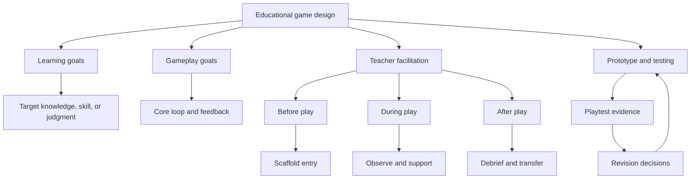
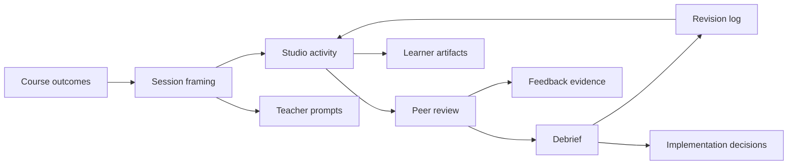

# Teacher Digital Curriculum Guide

  
Facilitator Handout 01

  
<strong>Module Focus:</strong> teaching moves, course rhythm, facilitation logic, and implementation support

  
<strong>Best Use:</strong> open the course, prepare weekly workshops, and coach teams during design studio sessions

  
<strong>Atlas:</strong> <a href="/C:/Users/jewoo/Documents/Playground/educational-game-design-resource-pack-en/00-master-curriculum-atlas.md">Master Curriculum Atlas</a>

<table>
  <tr>
    <td style="background:#123B5D; color:#FFFFFF; padding:6px 10px;"><strong>[FRAME]</strong></td>
    <td style="background:#0F766E; color:#FFFFFF; padding:6px 10px;"><strong>[MAP]</strong></td>
    <td style="background:#A16207; color:#FFFFFF; padding:6px 10px;"><strong>[ACTION]</strong></td>
    <td style="background:#2F855A; color:#FFFFFF; padding:6px 10px;"><strong>[CHECK]</strong></td>
    <td style="background:#7C3AED; color:#FFFFFF; padding:6px 10px;"><strong>[EVIDENCE]</strong></td>
    <td style="background:#B42318; color:#FFFFFF; padding:6px 10px;"><strong>[RISK]</strong></td>
    <td style="background:#334155; color:#FFFFFF; padding:6px 10px;"><strong>[LINKS]</strong></td>
  </tr>
</table>

  <strong>Facilitator Lens</strong> 
  Use this handout when you need to guide the learning process around the game, not just the game artifact itself. The most important design move in this module is the before-during-after facilitation cycle.

## [FRAME] Purpose

This guide helps facilitators run an `AI-enhanced Educational Game Design` microcredential for instructional designers, teachers, educators, curriculum developers, and learning experience professionals. It is designed for facilitators who want more than a syllabus. It provides teaching moves, workshop flow, discussion prompts, implementation supports, and troubleshooting guidance.

## [FRAME] Who This Guide Is For

- teacher educators
- professional development facilitators
- instructional design faculty
- school innovation leads
- EdTech coaches
- museum or public learning facilitators
- corporate learning facilitators

## [ACTION] What This Guide Supports

- before-session preparation
- during-session facilitation
- after-session debriefing
- learner support and intervention
- prototype review
- team management
- assessment calibration
- implementation planning

## [FRAME] Guiding Assumptions

- Educational game design is not only about making something fun. It is about aligning interaction, feedback, and challenge with intended learning.
- Teachers are not passive users of games. They are curriculum interpreters and facilitators of meaning-making.
- A good game-based learning experience needs design inside the game and facilitation outside the game.
- Debriefing is not optional. Without it, many games remain activity-rich but instructionally shallow.
- Learners should test ideas early and revise based on evidence.

## [MAP] Visual Concept Map

## [MAP] Facilitation Architecture At A Glance

## [ACTION] Course-Level Facilitation Model

Use a `before -> during -> after` cycle for every major workshop and prototype session.

### Before

- clarify the learning target
- frame the session question
- activate prior knowledge
- preview constraints and success criteria

### During

- support sense-making without over-directing
- observe how learners justify design choices
- surface assumptions
- keep teams focused on the smallest testable version

### After

- debrief what was learned
- connect design decisions back to pedagogy
- identify what evidence was gathered
- define the next revision move

## [ACTION] Session Planning Canvas

Use this visual planning sheet when designing a single workshop or project session.

| Phase | Purpose | Teacher Move | Learner Activity | Evidence To Watch |
|---|---|---|---|---|
| Before play | orient the group | frame the problem and surface prior knowledge | predict, recall, prepare | misconceptions, expectations |
| During play | support meaningful action | observe, question, redirect lightly | act, decide, test ideas | hesitation, strategy, confusion |
| After play | consolidate learning | debrief, compare paths, connect to practice | explain, reflect, revise | transfer language, self-correction |

## [CHECK] Facilitator Preparation Checklist

Complete this checklist before the course begins.

| Item | Check |
|---|---|
| Course outcomes are visible in the LMS or shared course document | [ ] |
| Assessment rubric is shared before project work begins | [ ] |
| Example educational games are pre-selected and tested | [ ] |
| Prototype tools have been chosen and access has been verified | [ ] |
| Playtesting forms are ready | [ ] |
| Team formation rules are defined | [ ] |
| Accessibility expectations are explicit | [ ] |
| File naming and submission rules are clear | [ ] |
| Facilitator feedback turnaround schedule is set | [ ] |
| Backup plan exists for technology failure | [ ] |

## [ACTION] Recommended Course Rhythm

### Weekly Flow

Use the following rhythm for each week or session block.

| Phase | Suggested Timing | Purpose |
|---|---:|---|
| Warm start | 10-15 min | Frame the question and reactivate prior work |
| Concept input | 20-35 min | Introduce the key idea or design pattern |
| Example analysis | 20-30 min | Build shared language through critique |
| Studio work | 45-75 min | Apply concepts directly to project work |
| Peer review | 20-30 min | Pressure-test ideas early |
| Exit reflection | 10 min | Capture design decisions and next steps |

## [ACTION] Session Facilitation Moves

### Move 1: Ask for the learning claim

When a team proposes a feature, ask:

- What do you want learners to know, do, or decide after this interaction?
- What evidence would show that this feature contributed to learning?

Use this when teams are drifting into novelty or visual polish too early.

### Move 2: Separate game goal from learning goal

Ask:

- What is the player trying to do in the game?
- What is the learner meant to understand or practice?
- Where do those overlap and where do they diverge?

Use this when teams assume engagement automatically creates learning.

### Move 3: Find the smallest testable loop

Ask:

- What is the minimum interaction that demonstrates the core idea?
- Can this be tested in 3-5 minutes with one learner?

Use this when scope is expanding too fast.

### Move 4: Push debrief design earlier

Ask:

- What should learners reflect on immediately after play?
- What misconception might appear if no debrief happens?

Use this when teams focus only on gameplay and ignore instructional closure.

### Move 5: Convert preference language into evidence language

If learners say, "I like this mechanic," ask:

- Why is it appropriate here?
- What kind of thinking does it require from the learner?
- What learning tradeoff does it create?

## [ACTION] Sample Facilitation Script

### Opening Script for the First Studio Session

Use or adapt the following:

> Today we are not trying to invent the biggest or flashiest game. We are trying to design a learning experience that earns its game form. Your job is to make clear why this should be a game, what learners will practice inside it, and what evidence will show that the design works.

### Mid-Project Coaching Script

> At this point, I care less about how complete your prototype is and more about whether you can explain your design logic. Show me the core loop, the feedback the learner receives, and the specific learning behavior that the loop is meant to provoke.

### Pre-Playtest Script

> When you run your test, do not defend the design too early. Let participants struggle a little. Watch where they hesitate, where they make assumptions, and where they understand the task for the wrong reason. That is useful data.

### Debrief Script

> Tell us one thing the playtest confirmed, one thing it complicated, and one revision you now believe is necessary.

## [ACTION] Debriefing Question Bank

Use these questions after prototype reviews or classroom implementation pilots.

### Learning-Focused Questions

- What did the player have to think about in order to succeed?
- Which actions were merely procedural, and which required meaningful judgment?
- What misconception might this design accidentally reinforce?
- What part of the game most clearly supports the intended learning outcome?

### Design-Focused Questions

- Where did the player experience friction that was productive?
- Where did the friction become unnecessary confusion?
- What feedback was missing or too delayed?
- Did the rules support the learning task or distract from it?

### Facilitation-Focused Questions

- What would a teacher need to explain before play begins?
- What would a teacher need to notice while learners are playing?
- What prompts are required after play to consolidate learning?

## [RISK] Common Learner Challenges and Suggested Facilitator Responses

| Challenge | What It Looks Like | Facilitator Response |
|---|---|---|
| Over-scoping | Teams plan multiple levels, systems, and reward structures too early | Ask for the smallest loop that proves the concept |
| Mechanic drift | Mechanics are interesting but loosely connected to learning | Ask for a direct map between action, feedback, and learning target |
| Gamification confusion | Teams add badges, points, or leaderboards without a game structure | Ask whether these features change decision-making or only decorate progress |
| Weak teacher role | Teams design a game but not a learning implementation plan | Require a before-during-after facilitation plan |
| No revision logic | Teams collect feedback but do not use it | Ask what decision changed because of the playtest |
| Tool fixation | Teams argue about platform features instead of pedagogy | Move the conversation back to learner experience and evidence |

## [ACTION] Intervention Guide by Project Stage

### Stage 1: Problem Framing

Look for:

- vague or overly broad topics
- no defined learner group
- no authentic reason to use a game form

Intervene by asking:

- Who specifically is this for?
- What makes this hard to learn or practice in a traditional format?
- Why is interactivity necessary here?

### Stage 2: Learning Alignment

Look for:

- generic objectives
- objectives written as content coverage
- no assessment evidence

Intervene by asking:

- What will the learner do that demonstrates understanding?
- What type of evidence can be observed during play?

### Stage 3: Prototype Planning

Look for:

- too many rules at once
- no feedback loop
- no failure state or consequence

Intervene by asking:

- What happens when the player makes a poor decision?
- How does the game respond quickly enough to support learning?

### Stage 4: Playtesting

Look for:

- defensive presenting
- leading participants
- collecting opinions instead of evidence

Intervene by asking:

- What behaviors are you watching for?
- What counts as usable feedback for your next revision?

## [ACTION] Teacher-Facing Implementation Template

Use this as a one-page summary for classroom adoption.

### Game Title

`[Insert title]`

### Intended Learners

`[Age/grade/profession, prior knowledge, group size]`

### Learning Goals

- `[Goal 1]`
- `[Goal 2]`
- `[Goal 3]`

### Estimated Duration

`[Total time]`

### Materials and Devices

- `[Devices/platforms]`
- `[Printed materials]`
- `[Accessibility supports]`

### Before Play

- teacher explains `[context]`
- teacher models `[critical action or concept]`
- learners review `[terms, concepts, scenario]`

### During Play

- teacher monitors `[key misconception or behavior]`
- teacher pauses for support if `[condition]`
- learners record `[notes, decisions, evidence]`

### After Play

- discussion prompt: `[question]`
- reflection task: `[task]`
- assessment artifact: `[artifact]`

### Risks to Watch

- `[risk 1]`
- `[risk 2]`

### Success Indicators

- `[indicator 1]`
- `[indicator 2]`

## [RISK] Troubleshooting Guide

### If the prototype is too confusing

- simplify the rules page
- reduce the number of choices
- add immediate feedback after the first action
- observe first-click behavior

### If learners are engaged but not learning

- inspect whether success depends on target knowledge or only on trial and error
- strengthen reflection prompts
- redesign feedback to expose reasoning, not just correctness

### If learners understand the content but do not want to continue

- reduce dead time
- improve decision stakes
- add more visible consequences
- make progress legible

### If teachers resist the game format

- provide a stronger curriculum alignment summary
- shorten setup steps
- offer a ready-to-use facilitation plan
- provide evidence from a small pilot

## [CHECK] Accessibility and Inclusion Prompts for Facilitators

Before approving a prototype, ask:

- Can this activity be completed without relying only on color?
- Can a learner participate without fast reaction speed?
- Can essential information be perceived in more than one mode?
- Is failure informative rather than shaming?
- Are cultural assumptions or examples likely to exclude some learners?

## [EVIDENCE] Documentation Expectations for Learners

Require every team to maintain:

- a versioned design log
- a mechanic-to-learning map
- a facilitation plan
- a revision history
- a playtesting evidence summary

## [ACTION] Facilitator Feedback Template

Use this structure for concise, consistent coaching.

### Strength

`[What is promising and why]`

### Misalignment

`[Where the learning and gameplay are not yet aligned]`

### Evidence Gap

`[What still needs to be tested or demonstrated]`

### Next Revision

`[The highest-value next change]`

### Suggested Prompt

`[A question that helps the team think rather than just comply]`

## [ACTION] End-of-Course Reflection Prompts

- How has your view of educational games changed?
- What did you learn about the teacher's role in game-based learning?
- What design decision changed most after testing?
- What would you need before implementing this in a real classroom or training environment?

## [RISK] Core Facilitation Tensions

| Tension | Why It Appears | Warning Sign | What Facilitators Often Do Wrong | Better Move |
|---|---|---|---|---|
| learner freedom vs teacher control | open-ended play can feel messy in formal education | the teacher interrupts every uncertainty | over-explaining the task until no meaningful decision remains | define the goal clearly, then let the learner struggle productively |
| engagement vs curriculum alignment | learners may enjoy the activity for the wrong reason | students can win without target reasoning | praising excitement as if it were evidence of learning | ask what thought process success actually depends on |
| rapid pacing vs reflective depth | games create momentum but learning needs interpretation | sessions end immediately after the final move | skipping debrief because play took longer than expected | shorten play if needed, but preserve a structured debrief |
| competition vs inclusion | leaderboards and speed can motivate some learners and alienate others | quieter or less confident learners disengage early | assuming a single motivational structure fits all groups | provide cooperative, reflective, or multi-path options |
| fidelity vs classroom reality | realistic simulation can exceed actual course time and resources | setup or explanation consumes too much time | defending realism while ignoring usability | keep only the elements that change the target decision or judgment |

## [ACTION] Mitigation Strategies For Challenging Facilitation Moments

| Situation | Immediate Mitigation | Deeper Design Response |
|---|---|---|
| learners keep asking what the right move is | respond with a question about evidence, goal, or consequence | redesign the opening so the first action is more legible |
| one confident learner dominates the team | assign turn-based roles or evidence responsibilities | redesign collaboration so different perspectives matter |
| learners treat the game as a race rather than a learning task | pause and ask what signals informed their choices | revise reward structure so speed does not overwhelm reasoning |
| teacher talk becomes longer than learner action | set a maximum intervention rule during play | simplify the instructions or reduce simultaneous mechanics |
| post-play discussion is shallow | require learners to compare intended and actual strategies | build in reflection artifacts such as decision logs or short rationale prompts |

## [ACTION] Scenario Snapshots For Facilitator Training

### Scenario 1: The Too-Helpful Teacher

A facilitator notices that learners are confused in the first three minutes and immediately begins explaining every option on screen.

Use this to discuss:

- what confusion is actually useful data
- what minimum clarification is justified
- how much intervention changes the validity of the playtest or learning experience

### Scenario 2: The Over-Competitive Team

A team adds points, timers, and rankings to increase energy, but the mechanic begins rewarding speed over explanation.

Use this to discuss:

- whether the target learning outcome is conceptual, procedural, or strategic
- whether the scoring system is amplifying or distorting the learning task
- how to redesign challenge without stripping away momentum

### Scenario 3: The Strong Game, Weak Debrief

Learners are deeply engaged during play, but the session ends with only a quick "What did you think?" question.

Use this to discuss:

- what meaning-making opportunities were lost
- what misconceptions might remain invisible
- what one or two high-leverage debrief prompts could recover the learning value

## [CHECK] Critical Thinking Question Bank For Facilitators

- What is the most educationally consequential moment in this game, and how will the teacher notice it?
- Where should the facilitator remain silent so that the learner's reasoning becomes visible?
- Which part of the design currently depends too much on teacher rescue?
- If learners misunderstand the rules, is that a facilitation problem, a game design problem, or both?
- Which learners are most likely to benefit from the current structure, and which might be marginalized by it?
- What would have to change if this activity were used in a lower-tech, shorter, or higher-stakes setting?

## [LINKS] Recommended Companion Files

- [02-worked-examples-casebook.md](C:/Users/jewoo/Documents/Playground/educational-game-design-resource-pack-en/02-worked-examples-casebook.md)
- [03-playtesting-toolkit.md](C:/Users/jewoo/Documents/Playground/educational-game-design-resource-pack-en/03-playtesting-toolkit.md)
- [04-portfolio-exemplar-set.md](C:/Users/jewoo/Documents/Playground/educational-game-design-resource-pack-en/04-portfolio-exemplar-set.md)
