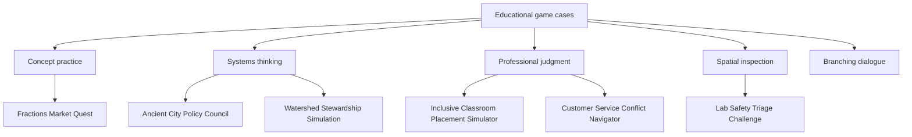
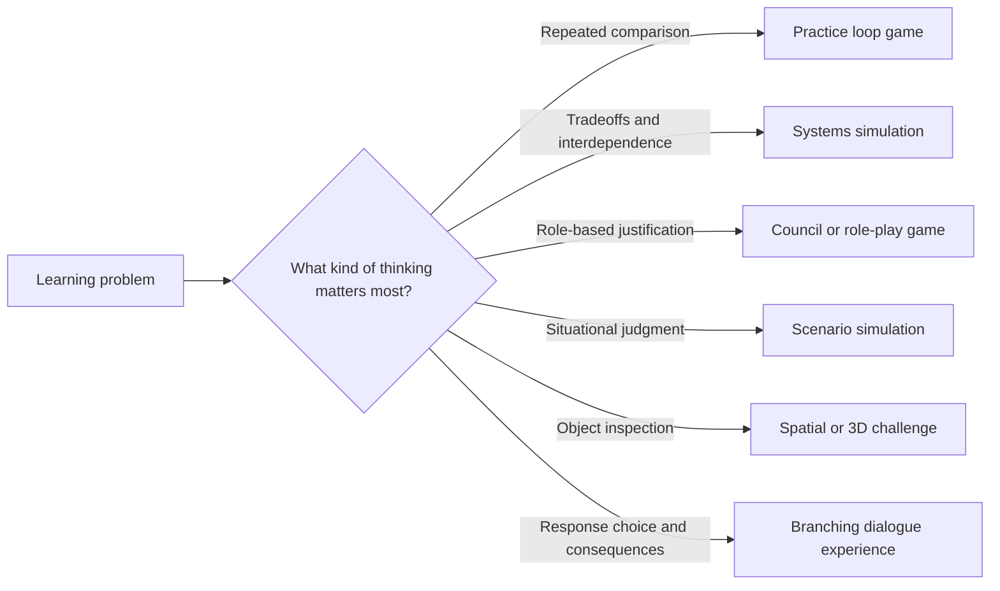

# Worked Examples Casebook

  
Facilitator Handout 02

  
<strong>Module Focus:</strong> worked examples, game form selection, and design calibration

  
<strong>Best Use:</strong> compare educational game concepts early, discuss fit, and model critique language for teams

  
<strong>Atlas:</strong> <a href="/C:/Users/jewoo/Documents/Playground/educational-game-design-resource-pack-en/00-master-curriculum-atlas.md">Master Curriculum Atlas</a>

<table>
  <tr>
    <td style="background:#123B5D; color:#FFFFFF; padding:6px 10px;"><strong>[FRAME]</strong></td>
    <td style="background:#0F766E; color:#FFFFFF; padding:6px 10px;"><strong>[MAP]</strong></td>
    <td style="background:#A16207; color:#FFFFFF; padding:6px 10px;"><strong>[ACTION]</strong></td>
    <td style="background:#2F855A; color:#FFFFFF; padding:6px 10px;"><strong>[CHECK]</strong></td>
    <td style="background:#7C3AED; color:#FFFFFF; padding:6px 10px;"><strong>[EVIDENCE]</strong></td>
    <td style="background:#B42318; color:#FFFFFF; padding:6px 10px;"><strong>[RISK]</strong></td>
    <td style="background:#334155; color:#FFFFFF; padding:6px 10px;"><strong>[LINKS]</strong></td>
  </tr>
</table>

  <strong>Teaching Use</strong> 
  Use these cases to help learners answer a hard but essential question: what kind of game form actually fits this learning problem, and what kind only looks engaging on the surface?

## [FRAME] Purpose

This casebook gives learners and facilitators concrete, critique-ready examples of educational game concepts. It is meant to reduce abstraction, build shared language, and help teams distinguish between a promising design and a superficial one.

## [ACTION] How To Use This Casebook

Use these cases to:

- analyze educational game structure
- compare game-based learning to basic gamification
- examine facilitation and debrief design
- discuss scope and feasibility
- prepare learners to write stronger design briefs

Each case includes:

- context
- learner group
- learning problem
- why a game is justified
- intended outcomes
- gameplay loop
- facilitation notes
- likely risks
- revision ideas
- Three.js implementation bridge

## [MAP] Visual Concept Map

## [MAP] Game Form Selection Visual

## [MAP] Cross-Case Visual Comparison Matrix

| Case | Dominant Learning Move | Core Mechanic | Teacher Role | Strong Fit For 3D? |
|---|---|---|---|---|
| Fractions Market Quest | compare and justify | quantity selection | prompt reasoning | low to medium |
| Ancient City Policy Council | weigh tradeoffs | collaborative policy debate | moderate discussion | medium |
| Inclusive Classroom Placement Simulator | interpret context and decide | scenario decision path | reflective facilitation | medium |
| Lab Safety Triage Challenge | inspect and prioritize | hazard detection and ranking | targeted debrief | high |
| Watershed Stewardship Simulation | see system change over time | environment management | short transfer prompts | high |
| Customer Service Conflict Navigator | choose relational response | branching dialogue | compare paths | medium |

## [ACTION] Case 1: Fractions Market Quest

### Context

An upper elementary math teacher wants students to practice comparing fractions and equivalent fractions in a more applied way than worksheets allow.

### Learner Group

- grades 4-5
- emerging comfort with symbolic notation
- mixed confidence in math

### Learning Problem

Students can complete routine exercises but struggle to apply fraction reasoning in context.

### Why a Game Is Justified

The content involves repeated judgment under changing constraints. A game can create repeated decision opportunities with visible consequences.

### Intended Learning Outcomes

- compare fractions using meaningful reasoning
- identify equivalent fractions
- make quantity decisions under budget constraints

### Core Gameplay Loop

1. Player receives an order from a market customer.
2. Player selects containers or item bundles with fractional quantities.
3. Game provides immediate feedback on whether the order matches the request.
4. Player earns trust or loses time based on the decision.
5. New orders become more complex.

### Why This Is Better Than Simple Gamification

Points are not the main instructional feature. The learning happens because successful play depends on comparing quantities correctly.

### Teacher Facilitation Notes

- Before play: review unit fractions and equivalence with manipulatives.
- During play: watch whether students justify choices mathematically or rely on guessing.
- After play: ask students to explain one successful and one unsuccessful decision.

### Risks

- learners may optimize for speed instead of reasoning
- feedback may become binary without explanatory value
- interface may privilege memorization over conceptual comparison

### Revision Ideas

- add "show your reasoning" checkpoints
- provide visual area models after incorrect choices
- include collaborative rounds where peers compare strategies

### Three.js Bridge

Possible scene objects:

- customer station
- ingredient containers
- measuring trays
- feedback panel

Possible interactions:

- click or drag containers
- inspect quantity models
- confirm order

## [ACTION] Case 2: Ancient City Policy Council

### Context

A secondary social studies teacher wants students to understand the tradeoffs in governing an ancient city rather than memorizing isolated facts.

### Learner Group

- grades 8-10
- basic background knowledge in history
- ready for role-based discussion

### Learning Problem

Students know terminology but struggle to understand how political, economic, and social systems interact.

### Why a Game Is Justified

The topic involves systems thinking, competing priorities, and contextual decision-making. A council simulation creates authentic tradeoffs.

### Intended Learning Outcomes

- analyze historical decision tradeoffs
- explain relationships between resources, power, and public response
- justify policy decisions using evidence

### Core Gameplay Loop

1. Each player assumes a civic role.
2. A problem card presents a crisis.
3. The group debates policy options.
4. The system reveals consequences across multiple indicators.
5. The next round builds on previous choices.

### Teacher Facilitation Notes

- Before play: assign short role primers.
- During play: prevent dominant voices from controlling all decisions.
- After play: compare student decisions with historical cases.

### Risks

- role-play may become theatrical but not analytical
- players may treat the simulation as morally simple
- consequences may feel arbitrary if rules are not transparent

### Revision Ideas

- add evidence cards with historical constraints
- require written rationale before votes
- include debrief on presentism and bias

### Three.js Bridge

Potential implementation path:

- 3D council chamber
- clickable role stations
- event cards
- civic indicator dashboard

## [ACTION] Case 3: Inclusive Classroom Placement Simulator

### Context

A teacher education program wants preservice teachers to reflect on placement decisions and instructional support choices in inclusive classrooms.

### Learner Group

- preservice teachers
- basic exposure to classroom management and inclusion frameworks

### Learning Problem

Learners often hold simplified beliefs about placement decisions and do not fully anticipate tradeoffs.

### Why a Game Is Justified

A simulation allows learners to test decisions, see consequences, and revisit assumptions in a safer environment than live placement.

### Intended Learning Outcomes

- analyze inclusive placement scenarios
- identify contextual variables that affect support decisions
- reflect on how beliefs influence practice

### Core Gameplay Loop

1. Player reviews a learner profile and school context.
2. Player selects support and placement decisions.
3. The simulation shows short-term and longer-term consequences.
4. Player compares intended and actual outcomes.
5. Reflection prompts ask for reasoning and revision.

### Teacher Facilitation Notes

- Before play: ground learners in inclusive education principles.
- During play: ask learners to name what assumptions they are making.
- After play: compare different decision paths and discuss ethical tensions.

### Risks

- oversimplifying disability and inclusion issues
- presenting deterministic outcomes
- making the "correct" path too obvious

### Revision Ideas

- include ambiguous cases
- add family and school stakeholder perspectives
- ask learners to defend a revision after new information appears

### Three.js Bridge

Useful features:

- learner profile interface
- classroom layout view
- stakeholder message popups
- state-based consequence timeline

## [ACTION] Case 4: Lab Safety Triage Challenge

### Context

A higher education STEM program wants students to identify and prioritize safety risks in a teaching laboratory.

### Learner Group

- first-year university students
- limited procedural experience

### Learning Problem

Students can recall rules but may not notice hazards or prioritize response steps in realistic situations.

### Why a Game Is Justified

The learning target is situational judgment. A timed but reflective triage challenge creates repeated detection and prioritization practice.

### Intended Learning Outcomes

- identify common lab hazards
- prioritize risk response
- justify intervention choices

### Core Gameplay Loop

1. Player enters a lab scenario.
2. Player inspects the space and tags hazards.
3. Player prioritizes response actions.
4. Game reveals risk consequences and rationale.
5. New scenario adds complexity.

### Teacher Facilitation Notes

- Before play: review categories of hazard.
- During play: observe whether players scan systematically.
- After play: connect to institutional safety procedures.

### Risks

- players may click randomly to find all hazards
- timed pressure may reduce reflection
- visual design may hide important cues unfairly

### Revision Ideas

- require confidence ratings after each tag
- use an explanation panel after each scenario
- create novice and advanced modes

### Three.js Bridge

Ideal 3D affordances:

- inspectable lab benches
- object highlighting
- clickable hazards
- camera movement for close inspection

## [ACTION] Case 5: Watershed Stewardship Simulation

### Context

A museum education team wants visitors to understand how local land-use decisions affect watershed health.

### Learner Group

- mixed-age public audience
- short interaction window
- minimal prior knowledge assumed

### Learning Problem

Visitors often understand environmental issues as isolated facts rather than interconnected systems.

### Why a Game Is Justified

A short systems simulation lets visitors see how multiple decisions compound over time.

### Intended Learning Outcomes

- describe relationships between land use and water quality
- anticipate system-level consequences
- compare short-term gains and long-term sustainability

### Core Gameplay Loop

1. Player selects development actions.
2. The watershed responds over time.
3. Indicators change visibly.
4. Player makes adjustments in the next cycle.
5. End-state summary compares paths.

### Teacher Facilitation Notes

- Keep instructions under one minute.
- Encourage family or group talk while decisions are made.
- Use a post-play prompt wall for visitor reflection.

### Risks

- too many variables for short public interactions
- superficial understanding if the summary is too brief
- accessibility barriers in a noisy museum setting

### Revision Ideas

- add prebuilt scenario presets
- offer "what changed and why" summaries
- support cooperative play

### Three.js Bridge

Potential features:

- terrain model
- water flow visualization
- clickable land parcels
- environmental indicator overlays

## [ACTION] Case 6: Customer Service Conflict Navigator

### Context

A workplace learning team wants new staff to practice de-escalation and decision-making in customer service interactions.

### Learner Group

- adult learners
- mixed professional backgrounds
- job-relevant motivation

### Learning Problem

Learners know policy statements but struggle to choose effective responses in emotionally charged situations.

### Why a Game Is Justified

Branching interaction and immediate consequence feedback support repeated practice in a low-risk setting.

### Intended Learning Outcomes

- identify escalation triggers
- choose context-appropriate response moves
- reflect on how tone and timing influence outcomes

### Core Gameplay Loop

1. Player enters a customer interaction scene.
2. Player chooses from response options or interaction tools.
3. Customer state shifts based on the response.
4. Player receives feedback on policy alignment and relational outcome.
5. Scenario branches continue or resolve.

### Teacher Facilitation Notes

- Before play: define success beyond policy compliance.
- During play: ask learners to predict likely customer reactions.
- After play: compare "technically correct" and "relationally effective" choices.

### Risks

- branching may collapse into obvious right/wrong paths
- emotional realism may be weak
- learners may game the score instead of reflecting

### Revision Ideas

- add confidence or tone meters
- make some choices partially effective rather than binary
- include manager follow-up reflection

### Three.js Bridge

Possible design approach:

- first-person or over-the-shoulder service desk scene
- dialogue choices
- state-driven facial or environmental cues
- interaction log for replay

## [ACTION] Cross-Case Comparison Prompts

Use these prompts with learners after reviewing two or more cases.

- Which cases truly require a game form and which could be taught as a standard activity?
- Which cases rely most on feedback, and what kind of feedback is instructional?
- Which designs create productive failure rather than random failure?
- In which case is the teacher's role most visible?
- Which case seems easiest to prototype first, and why?

## [RISK] Cross-Case Tensions And Design Tradeoffs

| Tradeoff | What It Looks Like In Cases | Design Risk | Mitigation |
|---|---|---|---|
| simplicity vs authenticity | a classroom simulation becomes realistic enough to feel messy | learners spend energy decoding complexity rather than learning | preserve only the realistic variables that change the target reasoning |
| procedural fluency vs conceptual understanding | players can succeed through repetition without explanation | the game trains speed but not understanding | add explanation checkpoints, comparison prompts, or reflective feedback |
| role immersion vs analytical distance | role-play becomes theatrical rather than evidence-based | players enjoy identity play but skip argument quality | require evidence cards, rationale writing, or structured comparison after play |
| open exploration vs guided learning | learners wander a scenario without noticing the intended issue | the environment feels rich but instructionally diffuse | add selective cues, mission framing, or sequenced tasks |
| emotional realism vs ethical safety | workplace or inclusion scenarios hit emotionally sensitive issues | players oversimplify or stereotype people and contexts | include ambiguity, multiple perspectives, and debrief questions about bias |

## [ACTION] Mitigation Strategies By Game Form

| Game Form | Typical Weakness | Mitigation Move | Example |
|---|---|---|---|
| practice loop game | becomes repetitive drill | vary the decision context while preserving the same target skill | fraction comparison appears through different customer requests |
| systems simulation | too many variables overwhelm learners | reveal variables in stages and make consequences visible | watershed health indicators appear gradually, not all at once |
| role-play or council game | loud voices dominate and nuance disappears | assign evidence roles and decision constraints | each policy advocate must cite one constraint before voting |
| spatial inspection game | random clicking replaces inspection | require prioritization, confidence ratings, or justification | lab hazard tagging must be ranked and defended |
| branching dialogue game | choices collapse into obvious right and wrong paths | include partially effective options and delayed consequences | customer service responses can calm one issue while worsening another |

## [ACTION] Additional Micro-Case Variations For Discussion

### Variation A: AI Literacy Rumor Response Game

Learners are asked to respond to AI-generated misinformation in a school community forum.

Discussion value:

- requires evaluation of evidence and communication choices
- raises ethical issues about speed, certainty, and public correction
- works well for branching dialogue or role-based moderation designs

### Variation B: Science Fieldwork Resource Allocation Simulation

Learners manage time, equipment, and team roles during a field investigation with changing weather and sample quality.

Discussion value:

- highlights tradeoffs under uncertainty
- supports systems simulation and teamwork design
- makes feasibility and data-quality decisions visible

### Variation C: Museum Exhibit Narrative Builder

Learners curate exhibit objects to tell an inclusive historical story for a public audience.

Discussion value:

- surfaces selection bias and narrative framing
- invites role-play, argumentation, and comparative critique
- supports debrief around omission and perspective

## [CHECK] Critical Thinking Prompts For Case Comparison

- Which case most strongly depends on immediate feedback, and what kind of feedback is actually instructional?
- Where might a teacher overestimate engagement because the scenario itself is interesting?
- Which case is most vulnerable to oversimplifying social, ethical, or cultural complexity?
- If one mechanic were removed from each case, which removal would most improve educational clarity?
- Which case most clearly justifies Three.js, and which would likely be weakened by 3D implementation?
- What hidden assumptions about learners, prior knowledge, or access are built into each case?

## [CHECK] Case Critique Template

Use this template in class.

### Case Title

`[Insert title]`

### Learning Problem

`[What is difficult to learn here?]`

### Why a Game Form Fits

`[Why interaction, simulation, or role-play adds value]`

### Strongest Design Choice

`[Best mechanic or facilitation move]`

### Biggest Risk

`[Most likely point of failure]`

### Revision Priority

`[What should change first]`

## [LINKS] Recommended Companion Files

- [01-teacher-digital-curriculum-guide.md](C:/Users/jewoo/Documents/Playground/educational-game-design-resource-pack-en/01-teacher-digital-curriculum-guide.md)
- [03-playtesting-toolkit.md](C:/Users/jewoo/Documents/Playground/educational-game-design-resource-pack-en/03-playtesting-toolkit.md)
- [05-threejs-foundations-learning-pack.md](C:/Users/jewoo/Documents/Playground/educational-game-design-resource-pack-en/05-threejs-foundations-learning-pack.md)
