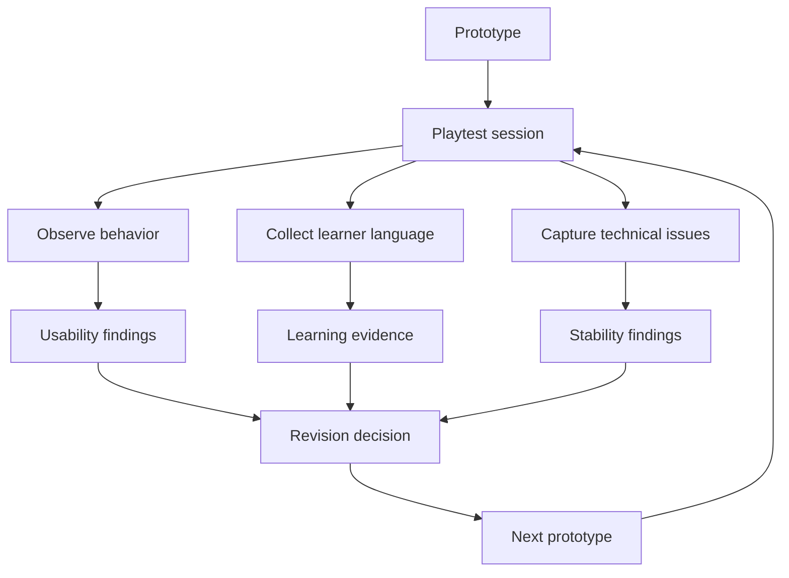
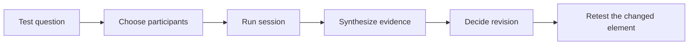

# Playtesting Toolkit

  
Facilitator Handout 03

  
<strong>Module Focus:</strong> evidence-based testing, observation, revision, and iterative improvement

  
<strong>Best Use:</strong> bring this out the moment a team has a core loop or decision path that can be observed by another person

  
<strong>Atlas:</strong> <a href="/C:/Users/jewoo/Documents/Playground/educational-game-design-resource-pack-en/00-master-curriculum-atlas.md">Master Curriculum Atlas</a>

<table>
  <tr>
    <td style="background:#123B5D; color:#FFFFFF; padding:6px 10px;"><strong>[FRAME]</strong></td>
    <td style="background:#0F766E; color:#FFFFFF; padding:6px 10px;"><strong>[MAP]</strong></td>
    <td style="background:#A16207; color:#FFFFFF; padding:6px 10px;"><strong>[ACTION]</strong></td>
    <td style="background:#2F855A; color:#FFFFFF; padding:6px 10px;"><strong>[CHECK]</strong></td>
    <td style="background:#7C3AED; color:#FFFFFF; padding:6px 10px;"><strong>[EVIDENCE]</strong></td>
    <td style="background:#B42318; color:#FFFFFF; padding:6px 10px;"><strong>[RISK]</strong></td>
    <td style="background:#334155; color:#FFFFFF; padding:6px 10px;"><strong>[LINKS]</strong></td>
  </tr>
</table>

  <strong>Evidence Lens</strong> 
  This handout helps teams move from opinion to evidence. If you need one sentence to anchor the module, use this: test the smallest meaningful loop, watch what learners actually do, and revise only what the evidence justifies.

## [FRAME] Purpose

This toolkit supports early and repeated playtesting for educational game prototypes. It is designed to help teams collect evidence about both usability and learning, then translate that evidence into revision decisions.

## [FRAME] Core Principle

Do not wait for a polished build to test. Test the smallest meaningful version of the experience as soon as the core loop exists.

## [FRAME] What Playtesting Is For

- finding confusion early
- checking whether the intended learning behavior actually appears
- identifying friction that helps learning versus friction that blocks it
- comparing designer assumptions with player experience
- deciding what to revise next

## [RISK] What Playtesting Is Not For

- proving the design is already good
- collecting praise
- asking only whether people "liked it"
- replacing instructional evaluation with casual observation

## [MAP] Visual Concept Map

## [MAP] Evidence Loop Visual

## [ACTION] Types of Playtests

| Type | Best For | Typical Artifact |
|---|---|---|
| Rule test | checking clarity of instructions | rules sheet, paper prototype |
| Core loop test | checking whether the main interaction works | rough prototype |
| Usability test | checking interface and navigation | clickable or digital prototype |
| Learning evidence test | checking whether target thinking appears | guided prototype session |
| Facilitation test | checking teacher moves and timing | classroom or workshop pilot |
| Technical test | checking stability and controls | digital build |

## [MAP] Playtesting Signal Dashboard

| Signal Type | What To Notice | Example Data Source | What It Usually Means |
|---|---|---|---|
| confusion | hesitation, repeated misclicks, rule questions | observation notes | instructions or affordances are weak |
| engagement | persistence, comments, replay interest | field notes, survey | challenge may be meaningful |
| learning evidence | justification, transfer language, correction after feedback | think-aloud, interview | target thinking is appearing |
| facilitation need | dependency on teacher prompts | classroom pilot notes | teacher guide needs revision |
| technical friction | lag, failed clicks, broken state | technical QA notes | prototype stability is affecting validity |

## [ACTION] Recommended Testing Cycle

### Cycle 1: Can players understand what to do?

Goal:

- confirm rule clarity
- confirm the first action is legible

### Cycle 2: Does the loop feel meaningful?

Goal:

- inspect challenge
- inspect feedback timing
- inspect decision quality

### Cycle 3: Does the loop support the learning target?

Goal:

- observe reasoning
- inspect misconceptions
- inspect whether success depends on the intended knowledge or skill

### Cycle 4: Can this run in a real learning setting?

Goal:

- test timing
- test teacher facilitation
- test setup and transition

## [ACTION] Playtest Planning Template

### Project Title

`[Insert title]`

### Prototype Version

`[Version name or date]`

### Test Goal

`[What exactly are we trying to learn from this test?]`

### Questions We Want Answered

- `[Question 1]`
- `[Question 2]`
- `[Question 3]`

### Participants

- number: `[n]`
- profile: `[target learners / proxy learners / educators]`
- prior knowledge: `[brief note]`

### Materials

- prototype
- instructions
- observation sheet
- consent or participation note if needed
- post-play survey or interview questions

### Success Signals

- `[signal 1]`
- `[signal 2]`

### Warning Signals

- `[signal 1]`
- `[signal 2]`

## [ACTION] Facilitator Script for a Playtest

### Opening Script

> Thank you for testing this prototype. We are testing the design, not you. If something is confusing, that is useful information for us. Please try to think aloud when possible and tell us what you expect, notice, or find unclear.

### During-Test Prompts

Use sparingly:

- What are you trying to do right now?
- What do you think will happen if you choose that?
- What is confusing here?
- What information do you wish you had?

Do not use:

- The correct action is...
- You should click there...
- It makes sense if you know the backstory...

### Closing Script

> Thank you. We are going to use your feedback to revise the prototype. Before we end, we want to understand what stood out to you and what still felt unclear or unnecessary.

## [EVIDENCE] Observation Sheet Template

### Participant ID

`[ID]`

### Date

`[Date]`

### Observer

`[Name]`

### Test Focus

`[What are we watching for in this session?]`

### Time-Stamped Notes

| Time | What the player did | What the player said | Possible interpretation |
|---|---|---|---|
| 00:00 |  |  |  |
| 00:00 |  |  |  |
| 00:00 |  |  |  |

### Key Moments to Mark

- first hesitation
- first incorrect assumption
- first successful completion
- visible frustration
- visible surprise
- spontaneous explanation

## [EVIDENCE] Think-Aloud Capture Template

Use this when reasoning is especially important.

| Prompt Moment | Player Verbalization | What This Suggests |
|---|---|---|
| First action |  |  |
| First mistake |  |  |
| Correction |  |  |
| Reflection after feedback |  |  |

## [EVIDENCE] Post-Play Interview Template

### Comprehension

- What did you think the goal was?
- At what point did the task become clear?
- What, if anything, stayed confusing?

### Experience

- What part felt most engaging?
- What part felt slow, frustrating, or unnecessary?
- When did the feedback help you most?

### Learning

- What did this activity make you notice, compare, or think about?
- What did you learn or practice?
- What would you still need help with?

### Transfer

- Where could this be useful outside the game?
- How would you explain the main idea to someone else?

## [EVIDENCE] Short Post-Play Survey

Use a 1-5 scale unless another scale is preferred.

| Item | Rating |
|---|---:|
| I understood what I was supposed to do |  |
| The feedback helped me improve my next action |  |
| The challenge level felt appropriate |  |
| The activity made me think about the target concept or skill |  |
| I could explain why I succeeded or failed |  |
| I would be willing to try another round |  |

Open-ended questions:

- One thing that helped me learn was...
- One thing that confused me was...
- One thing I would change is...

## [EVIDENCE] Learning Evidence Coding Sheet

Use this when the purpose of the game is conceptual understanding, procedural judgment, or strategic reasoning.

| Evidence Category | Description | Observed? | Notes |
|---|---|---|---|
| Concept use | Player uses target concept accurately | [ ] |  |
| Justification | Player explains decision with relevant reasoning | [ ] |  |
| Misconception | Player demonstrates a known misunderstanding | [ ] |  |
| Transfer attempt | Player connects the task to a broader context | [ ] |  |
| Reflection | Player revises strategy after feedback | [ ] |  |

## [CHECK] Usability Issue Severity Scale

| Severity | Meaning | Typical Action |
|---|---|---|
| 1 | minor annoyance | fix later |
| 2 | recurring friction | fix soon |
| 3 | major confusion | fix before next serious test |
| 4 | blocks play or learning | fix immediately |

## [EVIDENCE] Revision Decision Log

After each test, complete this table.

| Issue | Evidence | Category | Severity | Decision | Owner |
|---|---|---|---:|---|---|
|  |  | usability / learning / facilitation / technical |  | keep / revise / remove / retest |  |

## [EVIDENCE] Synthesis Template

### What the test confirmed

- `[confirmation 1]`
- `[confirmation 2]`

### What the test complicated

- `[complication 1]`
- `[complication 2]`

### What we did not learn yet

- `[gap 1]`
- `[gap 2]`

### Highest-value next revision

`[Describe the next change and why it matters]`

## [CHECK] Classroom Pilot Checklist

Use this when running a more realistic session.

| Item | Check |
|---|---|
| room setup was clear | [ ] |
| login or access worked | [ ] |
| learners understood the initial task | [ ] |
| timing matched the plan | [ ] |
| teacher prompts were sufficient but not intrusive | [ ] |
| debrief happened immediately after play | [ ] |
| assessment artifact was collected | [ ] |

## [RISK] Common Playtesting Mistakes

- testing too late
- giving too much explanation during play
- asking vague "Did you like it?" questions
- ignoring teacher implementation issues
- collecting feedback but not documenting revision decisions
- assuming engagement means learning

## [RISK] Playtesting Conflict Map

| Conflict | Why It Happens | Bad Default Move | Better Decision Rule |
|---|---|---|---|
| natural behavior vs ethical support | testers struggle and observers feel pressure to intervene | helping too early and erasing the evidence | intervene only when confusion becomes unsafe, disrespectful, or unrecoverable |
| speed of testing vs quality of evidence | teams want fast feedback and short sessions | collecting only reactions instead of decision evidence | define one test question and one evidence source before starting |
| target users vs proxy users | access to real learners is limited | assuming any participant gives equally useful data | note what kind of claims proxy testing can and cannot support |
| fun signals vs learning signals | positive affect is visible and easy to report | treating enjoyment as proof of success | separate engagement, comprehension, and learning evidence in the synthesis |
| teacher presence vs prototype validity | facilitators naturally scaffold during classroom pilots | making the design appear clearer than it actually is | record exactly when and how facilitator prompts changed the session |

## [ACTION] Mitigation Strategies For Ambiguous Findings

| Ambiguous Finding | Possible Interpretations | Mitigation |
|---|---|---|
| participants completed the task quickly | the design is clear, or the task is trivial | ask them to explain their strategy and confidence |
| participants asked many questions | the task is confusing, or the rules invite strategic dialogue | distinguish procedural clarification from conceptual uncertainty |
| participants enjoyed the activity | the challenge is meaningful, or the novelty carried the experience | compare enjoyment with evidence of target reasoning |
| participants failed repeatedly | the challenge is productive, or the interface blocks progress | inspect first-error patterns and timing, not only final outcomes |
| teacher support improved performance | facilitation is effective, or the prototype depends too much on rescue | rerun with lighter support and compare what changes |

## [ACTION] Sample Interpretation Scenarios

### Scenario 1: The Fast Success Problem

All five testers complete the prototype in less than three minutes and report that it felt easy.

Use this to discuss:

- whether the task was too simple
- whether prior knowledge was underestimated
- whether success can be explained and transferred, not merely completed

### Scenario 2: The Enthusiastic Misconception

Participants say the prototype was fun and want to play again, but their explanations reveal a misconception the design never surfaced.

Use this to discuss:

- why engagement should not be the only success criterion
- what feedback might have hidden or reinforced the misconception
- what revision would make the misunderstanding more visible

### Scenario 3: The Teacher-Dependent Prototype

The classroom pilot goes smoothly, but only because the teacher repeatedly reframes the task for each group.

Use this to discuss:

- whether the teacher guide is compensating for a game design weakness
- which prompts are acceptable scaffolds and which are emergency repairs
- how to redesign onboarding to reduce facilitation dependency

## [CHECK] Critical Thinking Questions For Evidence Review

- What would count as evidence that the prototype is enjoyable but educationally weak?
- Which observation in this session would be most risky to overinterpret?
- What evidence is currently missing because the wrong data source was chosen?
- If this prototype were tested with actual target learners, what result might change most?
- Which failure in the session was productive and should remain, and which should be removed?
- What one revision would most improve the next round of evidence quality rather than only the prototype appearance?

## [CHECK] Minimum Evidence Standard Before Advancing a Prototype

Before moving from concept to a more polished prototype, teams should be able to show:

- the core loop can be completed by a target or proxy user
- at least one learning-relevant behavior appears during play
- one or more major confusion points have already been identified
- the team has written at least one concrete revision decision

## [LINKS] Recommended Companion Files

- [01-teacher-digital-curriculum-guide.md](C:/Users/jewoo/Documents/Playground/educational-game-design-resource-pack-en/01-teacher-digital-curriculum-guide.md)
- [04-portfolio-exemplar-set.md](C:/Users/jewoo/Documents/Playground/educational-game-design-resource-pack-en/04-portfolio-exemplar-set.md)
- [06-technical-qa-and-data-logging-checklists.md](C:/Users/jewoo/Documents/Playground/educational-game-design-resource-pack-en/06-technical-qa-and-data-logging-checklists.md)
