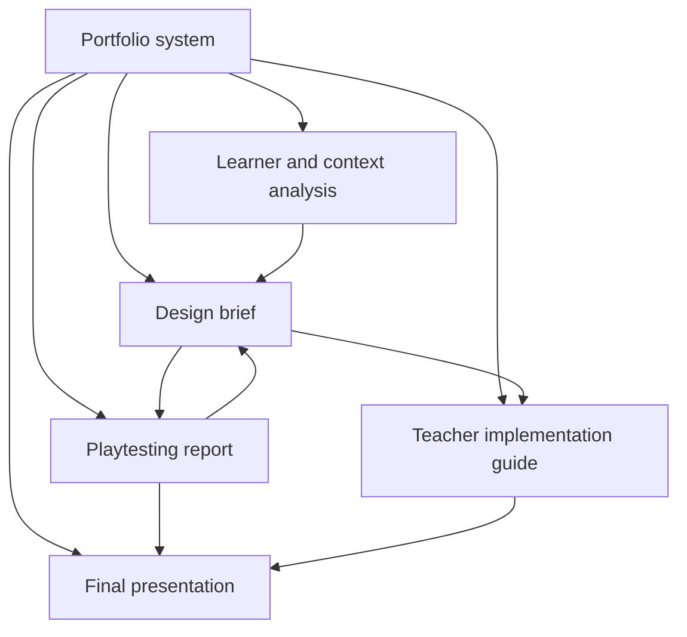
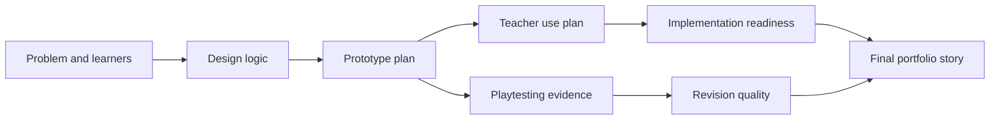

# Portfolio Exemplar Set

  
Facilitator Handout 04

  
<strong>Module Focus:</strong> portfolio quality, rubric calibration, and artifact expectations

  
<strong>Best Use:</strong> use before major submissions, during peer review, and when aligning evaluators around evidence of strong work

  
<strong>Atlas:</strong> <a href="/C:/Users/jewoo/Documents/Playground/educational-game-design-resource-pack-en/00-master-curriculum-atlas.md">Master Curriculum Atlas</a>

<table>
  <tr>
    <td style="background:#123B5D; color:#FFFFFF; padding:6px 10px;"><strong>[FRAME]</strong></td>
    <td style="background:#0F766E; color:#FFFFFF; padding:6px 10px;"><strong>[MAP]</strong></td>
    <td style="background:#A16207; color:#FFFFFF; padding:6px 10px;"><strong>[ACTION]</strong></td>
    <td style="background:#2F855A; color:#FFFFFF; padding:6px 10px;"><strong>[CHECK]</strong></td>
    <td style="background:#7C3AED; color:#FFFFFF; padding:6px 10px;"><strong>[EVIDENCE]</strong></td>
    <td style="background:#B42318; color:#FFFFFF; padding:6px 10px;"><strong>[RISK]</strong></td>
    <td style="background:#334155; color:#FFFFFF; padding:6px 10px;"><strong>[LINKS]</strong></td>
  </tr>
</table>

  <strong>Assessment Lens</strong> 
  This handout helps facilitators and learners see quality as a chain: problem framing, design logic, teacher implementation, testing evidence, and final portfolio story all need to connect.

## [FRAME] Purpose

This document helps learners understand what strong submission quality looks like across the major portfolio artifacts in the microcredential. It is not a set of fully written sample projects. It is an annotated benchmark pack that shows what strong work includes, what weak work often misses, and how evaluators can interpret quality.

## [ACTION] Portfolio Artifacts Covered

1. learner and context analysis
2. educational game design brief
3. teacher implementation guide
4. playtesting report
5. final portfolio presentation

## [ACTION] How To Use This Document

- Give it to learners before major submissions begin.
- Use it in peer review sessions to calibrate feedback.
- Use it in grading meetings to align evaluator expectations.

## [MAP] Visual Concept Map

## [MAP] Portfolio Development Flow

## [MAP] Portfolio Visual Scorecard

| Artifact | Main Question | Weak Signal | Strong Signal |
|---|---|---|---|
| learner and context analysis | what problem is being solved and for whom | broad topic only | specific learner, context, and need |
| design brief | why this game and how does it teach | disconnected features | clear mechanic-to-learning alignment |
| teacher guide | how does it run in practice | setup only | before-during-after facilitation support |
| playtesting report | what evidence changed the design | vague feedback summary | evidence-to-revision chain |
| final presentation | what is the strongest story of the project | feature list | coherent rationale, testing, and next steps |

## [CHECK] Exemplar Quality Bands

| Band | Description |
|---|---|
| Exemplary | coherent, evidence-based, and implementation-ready |
| Strong | mostly coherent and useful, with minor gaps |
| Developing | promising but under-justified or incomplete |
| Weak | unclear, misaligned, or not yet actionable |

## [ACTION] Artifact 1: Learner and Context Analysis

### What Exemplary Work Includes

- a clearly bounded learner group
- a specific learning or performance problem
- relevant contextual constraints
- a justified case for using a game form
- realistic assumptions about time, devices, and facilitation

### What Strong Work Sounds Like

> First-year nursing students can recite triage categories but struggle to prioritize in time-sensitive scenarios. Because the target behavior involves noticing, prioritizing, and justifying under uncertainty, a simulation-based design offers more value than a static quiz.

### What Developing Work Often Looks Like

> Students need to learn more about health care through a fun activity.

Why this is weaker:

- the learner group is vague
- the problem is broad
- the reason for a game form is not established

### Evaluator Questions

- Is the learning problem concrete enough to design for?
- Are real constraints acknowledged?
- Does the argument for game-based learning make sense?

## [ACTION] Artifact 2: Educational Game Design Brief

### What Exemplary Work Includes

- clear learning outcomes
- clear player goal
- a mechanic-to-learning map
- a defined core loop
- feedback logic
- failure or consequence design
- teacher role and implementation notes

### Mini Exemplar Structure

#### Learning Outcome

Learners will prioritize laboratory hazards based on likely severity and justify the order of intervention.

#### Player Goal

Stabilize the lab environment by identifying and sequencing the most urgent safety responses before time expires.

#### Core Loop

Inspect -> identify hazard -> prioritize response -> receive consequence feedback -> revise strategy

#### Why It Is Strong

- the learner does not just click items
- success requires the intended judgment
- the loop exposes consequences quickly

### Common Weaknesses

- lists mechanics without explaining why they fit
- confuses score with evidence of learning
- includes rewards but no meaningful consequences
- uses story setting as a substitute for design logic

## [ACTION] Artifact 3: Teacher Implementation Guide

### What Exemplary Work Includes

- estimated duration
- setup steps
- teacher talk moves
- monitoring guidance
- debrief plan
- assessment artifact
- adaptation suggestions

### Strong Example Snapshot

> Before play, the teacher reviews two sample hazard categories and models how to justify a response priority. During play, the teacher notes whether learners identify visual risk cues but ignore contextual risk. After play, learners compare their action order to the institutionally recommended order and explain discrepancies.

### Common Weaknesses

- only explains the game, not the teaching
- lacks a debrief structure
- assumes all teachers already know how to facilitate game-based learning

## [ACTION] Artifact 4: Playtesting Report

### What Exemplary Work Includes

- clear purpose of the test
- participant profile
- description of prototype version
- evidence collected
- major findings
- revision decisions tied to evidence

### Strong Reporting Move

> Three of five participants interpreted the visual alert icons as optional hints rather than urgent warnings. This affected the learning target because they treated hazard detection as a scavenger task instead of a prioritization task. We will revise the first scenario to make urgency cues clearer and add explanatory consequence feedback after the first missed alert.

### Weak Reporting Move

> Testers liked the game but said it needed to be clearer.

Why this is weak:

- no evidence
- no participant detail
- no actionable revision path

## [ACTION] Artifact 5: Final Portfolio Presentation

### What Exemplary Work Includes

- concise statement of the educational problem
- strong rationale for the game form
- visible prototype evidence
- honest description of what changed after testing
- realistic implementation or development next steps

### High-Value Presentation Moves

- show one short loop instead of describing the entire system
- compare an early and revised design decision
- explain one failure that improved the project
- articulate what must happen next before real deployment

## [CHECK] Consolidated Rubric

| Criteria | Exemplary | Strong | Developing | Weak |
|---|---|---|---|---|
| Problem framing | precise, contextualized, justified | clear but slightly broad | partially clear | vague or generic |
| Learning alignment | direct and persuasive | mostly aligned | uneven alignment | unclear alignment |
| Game design logic | coherent, purposeful loop | workable loop with gaps | partial or unstable loop | no meaningful loop |
| Facilitation design | teacher-ready | useful with minor gaps | limited teacher guidance | little to no teacher support |
| Playtesting evidence | strong evidence-to-revision chain | useful evidence | thin evidence | anecdotal only |
| Feasibility | realistic and scoped | mostly realistic | over-scoped or under-specified | implausible |

## [CHECK] Submission Self-Check for Learners

Use this before submitting.

| Question | Yes / No |
|---|---|
| Can I clearly state the learning problem in one sentence? |  |
| Can I explain why this should be a game rather than a standard activity? |  |
| Does successful play require the intended thinking or skill? |  |
| Have I described what the teacher does before, during, and after play? |  |
| Have I tested some part of this design with another person? |  |
| Can I name one revision made because of evidence? |  |

## [RISK] Portfolio Conflict Issues

| Conflict | How It Appears In Submissions | Why It Matters | Mitigation |
|---|---|---|---|
| polish vs evidence | slides and mockups look finished but revision logic is thin | aesthetics can hide design weakness | require visible testing evidence and decision history |
| breadth vs coherence | teams describe many features without a clear core loop | reviewers cannot see the design logic | ask for one dominant learning loop and one central claim |
| ambition vs feasibility | the portfolio promises systems no team could have tested | the project sounds visionary but is not defensible | reward scoped iteration more than speculative expansion |
| terminology vs understanding | submissions use design vocabulary without precise application | language sounds advanced but remains generic | ask for concrete examples, learner actions, and consequences |
| teacher guidance vs learner independence | the guide either overcontrols or under-supports learners | implementation quality becomes fragile | require explicit before, during, and after facilitation decisions |

## [ACTION] Mitigation Strategies For Artifact Weaknesses

| Weakness | Immediate Revision | Stronger Long-Term Fix |
|---|---|---|
| analysis is broad and generic | narrow the learner group and context | rewrite the problem as a specific performance challenge |
| design brief lists features instead of logic | remove non-essential features and foreground the core loop | map each mechanic to a specific learning behavior |
| teacher guide only explains setup | add monitoring and debrief prompts | specify what the teacher should notice and why |
| playtesting report summarizes opinions | add evidence quotes, behaviors, and timestamps | redesign the test question and data sources for the next round |
| final presentation feels like a showcase | foreground what changed and why | build the story around problem, evidence, and revision |

## [ACTION] Contrasting Mini-Examples

### Contrast 1: Weak vs Strong Rationale

Weak:

> We used a simulation because simulations are engaging and realistic.

Stronger:

> We used a simulation because the target learning outcome involves prioritizing under uncertainty, and learners need to see how multiple decisions interact over time.

### Contrast 2: Weak vs Strong Playtesting Claim

Weak:

> Testers thought the prototype was clear.

Stronger:

> Four of five testers completed the first loop without asking procedural questions, but three misread the feedback as a score summary rather than a reasoning cue. We will revise the feedback text and icon hierarchy.

### Contrast 3: Weak vs Strong Teacher Guide Move

Weak:

> Teacher introduces the game and lets students play.

Stronger:

> Before play, the teacher models one example of evidence-based decision-making. During play, the teacher notes whether learners justify choices or guess. After play, students compare one successful and one unsuccessful strategy.

## [CHECK] Critical Thinking Prompts For Review Panels

- Which artifact in this portfolio is doing too much compensatory work for another weak artifact?
- What looks persuasive at first glance but is not yet well evidenced?
- If the prototype were removed, would the written design logic still be coherent?
- Which design claim is strongest because it is backed by evidence, and which is weakest because it is only asserted?
- How would this portfolio need to change if the intended implementation setting became more constrained?
- What would make this project more educationally honest even if it became less visually impressive?

## [ACTION] Evaluator Comment Bank

### Problem Framing

- The learner group is well defined and the problem is instructionally meaningful.
- The rationale for using a game form is still too generic.
- The proposal needs a stronger explanation of why interactivity adds value here.

### Learning Alignment

- The link between player action and learning outcome is clear.
- The mechanics are promising, but the learning evidence remains indirect.
- The current scoring structure may reward speed more than understanding.

### Facilitation

- The teacher's role is thoughtfully designed.
- The guide explains setup, but not enough about monitoring or debriefing.
- The design still assumes a confident game-savvy teacher user.

### Revision

- The report shows real learning from testing and revision.
- The testing section is descriptive but not yet analytical.
- The team gathered feedback, but the next design decision is still unclear.

## [LINKS] Recommended Companion Files

- [01-teacher-digital-curriculum-guide.md](C:/Users/jewoo/Documents/Playground/educational-game-design-resource-pack-en/01-teacher-digital-curriculum-guide.md)
- [03-playtesting-toolkit.md](C:/Users/jewoo/Documents/Playground/educational-game-design-resource-pack-en/03-playtesting-toolkit.md)
- [02-worked-examples-casebook.md](C:/Users/jewoo/Documents/Playground/educational-game-design-resource-pack-en/02-worked-examples-casebook.md)
