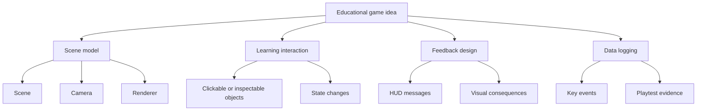
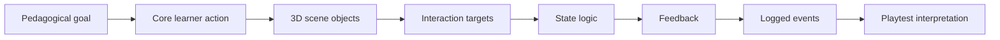

# Three.js Foundations Learning Pack

  
Facilitator Handout 05

  
<strong>Module Focus:</strong> moving from educational design logic into structured Three.js implementation planning

  
<strong>Best Use:</strong> bring this in when teams are ready to translate paper, flow, or interface prototypes into scene, interaction, and state plans

  
<strong>Atlas:</strong> <a href="/C:/Users/jewoo/Documents/Playground/educational-game-design-resource-pack-en/00-master-curriculum-atlas.md">Master Curriculum Atlas</a>

<table>
  <tr>
    <td style="background:#123B5D; color:#FFFFFF; padding:6px 10px;"><strong>[FRAME]</strong></td>
    <td style="background:#0F766E; color:#FFFFFF; padding:6px 10px;"><strong>[MAP]</strong></td>
    <td style="background:#A16207; color:#FFFFFF; padding:6px 10px;"><strong>[ACTION]</strong></td>
    <td style="background:#2F855A; color:#FFFFFF; padding:6px 10px;"><strong>[CHECK]</strong></td>
    <td style="background:#7C3AED; color:#FFFFFF; padding:6px 10px;"><strong>[EVIDENCE]</strong></td>
    <td style="background:#B42318; color:#FFFFFF; padding:6px 10px;"><strong>[RISK]</strong></td>
    <td style="background:#334155; color:#FFFFFF; padding:6px 10px;"><strong>[LINKS]</strong></td>
  </tr>
</table>

  <strong>Implementation Lens</strong> 
  This handout is for teams crossing the bridge from pedagogy to 3D structure. Keep the instructional question visible: why does 3D help the learner think, inspect, decide, or experience the problem more clearly?

## [FRAME] Purpose

This learning pack helps educators and instructional designers move from educational game concepts into structured Three.js implementation planning. It is written for beginners who may understand pedagogy well but are new to 3D interactive development.

## [FRAME] Why Three.js Matters for This Project

Three.js is useful when the educational game needs:

- spatial exploration
- inspectable environments
- object interaction
- system simulation with visible change over time
- scenario-based learning in a navigable space

It is not required for every educational game. A 3D environment is most justified when space, perspective, inspection, motion, or situated action are part of the learning value.

## [ACTION] Core Three.js Vocabulary

### Scene

The container for everything visible in the 3D world.

### Camera

Defines the viewer's perspective into the scene.

### Renderer

Draws the scene from the camera's point of view onto the screen.

### Mesh

A visible 3D object created from geometry and material.

### Light

Illuminates objects so the scene is visible and legible.

### Animation Loop

The repeated update-and-render cycle that keeps the scene interactive.

### Raycaster

A tool used to detect what object a pointer or click is targeting.

## [FRAME] Minimum Conceptual Model

The official three.js manual starts with three essentials:

- scene
- camera
- renderer

That is the minimum mental model beginners need before thinking about gameplay logic.

## [MAP] Visual Concept Map

## [MAP] Three.js Prototype Architecture

## [ACTION] Learning Sequence

### Module 1: Is 3D actually needed?

Ask:

- Does understanding depend on spatial relationships?
- Does the learner need to inspect objects or navigate a scene?
- Would a 2D or branching prototype teach this just as well?

If the answer is no, do not use Three.js only because it feels more advanced.

### Module 2: Scene Thinking

Translate a design document into:

- world objects
- player viewpoint
- important states
- interaction targets
- UI overlays

Use this worksheet:

| Design Element | Three.js Translation |
|---|---|
| learning environment | scene |
| learner viewpoint | camera |
| interactive object | mesh or grouped object |
| click target | raycast target |
| status information | HTML or canvas HUD |
| rule change | state update |

### Module 3: Coordinates and Camera

Teach beginners:

- 3D positions use x, y, z
- objects need meaningful scale
- camera placement affects comprehension
- camera movement is an instructional decision, not only a technical one

Ask:

- What should the learner see first?
- What must stay visible during decision-making?
- Does a free camera help or overwhelm?

### Module 4: The Animation Loop

Beginners should understand that interactive scenes update continuously.

Conceptually:

1. read input
2. update state
3. update object positions or properties
4. render scene

### Module 5: Delta Time

If a prototype has movement or time-based changes, use delta time so behavior stays consistent across different devices and frame rates.

Instructional note:

This matters even in educational prototypes because unreliable timing can distort the learner experience and testing results.

### Module 6: Picking and Interaction

Three.js uses techniques such as raycasting for pointer-based interaction.

Learners should map:

- what can be clicked
- what happens when it is clicked
- what feedback appears immediately
- what state changes in response

Use this interaction planning table:

| Object | Interaction | Immediate Feedback | State Change | Learning Relevance |
|---|---|---|---|---|
|  |  |  |  |  |

### Module 7: State-Driven Design

Do not treat a 3D prototype as only a collection of objects. It is a system with states.

Examples:

- intro
- exploration
- inspected
- decision submitted
- consequence shown
- reflection

Use a state map before coding complex logic.

### Module 8: HUD and Overlay Design

Many educational games need visible text, progress, instructions, or data. These often belong in an HTML overlay rather than inside the 3D world.

Good uses of HUD:

- objective reminders
- evidence log
- timer
- concept prompts
- feedback messages

### Module 9: Assets and Scope

Beginners should start with simple primitives and placeholders.

Recommended sequence:

1. boxes, spheres, planes
2. simple color coding
3. basic interaction
4. state transitions
5. only then more complex models or textures

Avoid importing polished assets too early. They create the illusion of progress while core design problems remain unresolved.

### Module 10: Performance for Educational Prototypes

Performance matters because lag changes how learners interpret the experience.

Teach the basics:

- keep scenes simple at first
- avoid too many objects updating unnecessarily
- use consistent timing
- test on lower-powered hardware when possible

## [MAP] Visual Translation Sheet

| Pedagogical Element | Three.js Design Decision | Example |
|---|---|---|
| what learners inspect | camera framing and object placement | close lab bench inspection |
| what learners manipulate | raycast targets or drag targets | selecting a hazard object |
| what changes after action | state update and feedback event | icon changes, status text, animation |
| what must stay visible | HUD overlay | timer, task goal, evidence notes |
| what gets tested | logged event sequence | first click, wrong choice, hint use |

## [CHECK] Three.js Readiness Checklist

Use this before moving into implementation.

| Question | Check |
|---|---|
| We can explain why 3D adds instructional value | [ ] |
| We have a list of scene objects | [ ] |
| We know what the learner can interact with | [ ] |
| We have a state map | [ ] |
| We know what feedback appears after each major action | [ ] |
| We know what stays in HUD versus the 3D world | [ ] |
| We have a minimal version that can be built first | [ ] |

## [ACTION] Three.js Planning Template

### Project Title

`[Insert title]`

### Why 3D Helps

`[One short paragraph]`

### Primary Learning Action

`[What the learner does in the world]`

### Scene Objects

- `[object 1]`
- `[object 2]`
- `[object 3]`

### Camera Plan

- starting view: `[description]`
- movement: `[fixed / guided / free / orbit]`
- why this view supports learning: `[explanation]`

### Interaction Targets

- `[target 1]`
- `[target 2]`

### Main States

- `[state 1]`
- `[state 2]`
- `[state 3]`

### HUD Elements

- `[element 1]`
- `[element 2]`

### Logged Events

- `[event 1]`
- `[event 2]`

## [ACTION] Mini Exercises

### Exercise 1: Translate a Paper Prototype

Choose a paper prototype and rewrite it as:

- scene objects
- camera needs
- interaction targets
- state changes

### Exercise 2: Find the First Click

For your project, identify:

- the first object the learner should notice
- the first click or interaction
- the feedback that follows

### Exercise 3: Simplify the Scene

Reduce your concept to only:

- one room or area
- three objects
- one decision
- one feedback event

If that version still teaches something meaningful, your design is on the right track.

## [RISK] Pedagogy-To-Engine Tensions

| Tension | Why It Happens | Common Weak Move | Better Move |
|---|---|---|---|
| visual ambition vs instructional clarity | teams equate 3D richness with educational quality | building a complex scene before the learning action is stable | implement the smallest meaningful spatial interaction first |
| realism vs performance | detailed environments feel authentic | importing heavy assets and unstable scenes too early | prototype with primitives, then add fidelity selectively |
| free exploration vs guided attention | 3D spaces invite wandering | allowing learners to miss the core task entirely | design camera framing, cues, and state transitions around the target decision |
| interface richness vs cognitive load | HUD, prompts, and indicators multiply quickly | placing too much text in-world and in HUD at once | separate must-see task cues from optional support information |
| technical possibility vs pedagogical need | a feature is possible, so it gets added | adding movement, physics, or inventory without learning justification | ask what instructional value each system adds before coding it |

## [ACTION] Mitigation Strategies For Overbuilding

| Overbuilding Pattern | Fast Mitigation | Better Structural Response |
|---|---|---|
| too many scene objects | remove all but three task-critical objects | rebuild from one room, one task, one feedback moment |
| too many interactions | keep only one primary interaction verb | define a clear interaction grammar for the whole prototype |
| too much environmental detail | replace complex assets with simple blocks or panels | validate the learning loop before art direction |
| unclear state logic | draw a state map on paper first | implement explicit state transitions rather than ad hoc triggers |
| unclear 3D value | freeze the project and justify why 3D helps | switch to 2D, branching, or paper prototype if 3D adds little |

## [ACTION] Scenario Comparisons Before Coding

### Scenario 1: Good 3D Justification

A lab safety game requires learners to inspect benches, notice spatial relationships, and prioritize hazards based on proximity and context.

Why it works:

- inspection is spatial
- visibility and camera framing matter
- object placement changes interpretation

### Scenario 2: Weak 3D Justification

A vocabulary revision activity is rebuilt as a 3D room where learners click floating terms to reveal definitions.

Why it is weak:

- the main learning action is not spatial
- 3D adds navigation cost but little conceptual value
- the same outcome could likely be achieved more clearly in 2D

### Scenario 3: Ambiguous 3D Justification

A branching ethical decision scenario is moved into a 3D office environment to increase realism.

Discussion value:

- the space may improve atmosphere
- the core learning may still depend mainly on dialogue and consequence logic
- teams should decide whether atmosphere alone justifies the added complexity

## [CHECK] Critical Thinking Questions Before Coding

- What does the learner perceive or decide differently because the experience is spatial?
- Which parts of the current concept are pedagogically essential, and which are technically tempting extras?
- What would break educationally if the scene were reduced to one room and three objects?
- Which information must remain visible at all times, and where should it live: scene, HUD, or notes?
- What state transition is most important to get right before anything else is built?
- If performance problems appear, which visual features would you remove first without damaging the instructional value?

## [RISK] Common Beginner Mistakes

- choosing 3D without instructional reason
- building visuals before defining states
- using too many assets too early
- mixing HUD text and in-world text confusingly
- not planning click targets clearly
- ignoring performance until late

## [LINKS] Official Documentation to Read First

- three.js manual: *Creating a scene*  
  https://threejs.org/manual/en/creating-a-scene.html
- three.js manual: *Picking*  
  https://threejs.org/manual/en/picking.html
- three.js docs: *Raycaster*  
  https://threejs.org/docs/pages/Raycaster.html

## [LINKS] Recommended Companion Files

- [06-technical-qa-and-data-logging-checklists.md](C:/Users/jewoo/Documents/Playground/educational-game-design-resource-pack-en/06-technical-qa-and-data-logging-checklists.md)
- [02-worked-examples-casebook.md](C:/Users/jewoo/Documents/Playground/educational-game-design-resource-pack-en/02-worked-examples-casebook.md)
- [03-playtesting-toolkit.md](C:/Users/jewoo/Documents/Playground/educational-game-design-resource-pack-en/03-playtesting-toolkit.md)
