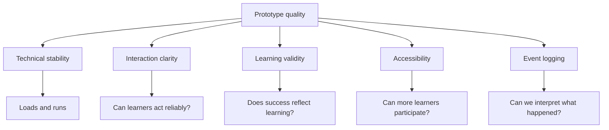
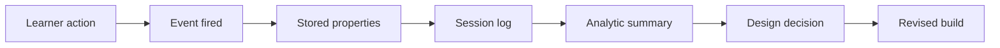

# Technical QA and Data Logging Checklists

  
Facilitator Handout 06

  
<strong>Module Focus:</strong> prototype reliability, interaction QA, accessibility checks, and event logging design

  
<strong>Best Use:</strong> use before formal playtests, classroom pilots, or digital release checkpoints

  
<strong>Atlas:</strong> <a href="/C:/Users/jewoo/Documents/Playground/educational-game-design-resource-pack-en/00-master-curriculum-atlas.md">Master Curriculum Atlas</a>

<table>
  <tr>
    <td style="background:#123B5D; color:#FFFFFF; padding:6px 10px;"><strong>[FRAME]</strong></td>
    <td style="background:#0F766E; color:#FFFFFF; padding:6px 10px;"><strong>[MAP]</strong></td>
    <td style="background:#A16207; color:#FFFFFF; padding:6px 10px;"><strong>[ACTION]</strong></td>
    <td style="background:#2F855A; color:#FFFFFF; padding:6px 10px;"><strong>[CHECK]</strong></td>
    <td style="background:#7C3AED; color:#FFFFFF; padding:6px 10px;"><strong>[EVIDENCE]</strong></td>
    <td style="background:#B42318; color:#FFFFFF; padding:6px 10px;"><strong>[RISK]</strong></td>
    <td style="background:#334155; color:#FFFFFF; padding:6px 10px;"><strong>[LINKS]</strong></td>
  </tr>
</table>

  <strong>Quality Lens</strong> 
  Use this handout to protect the validity of your testing. A prototype that runs poorly, hides key interactions, or logs the wrong events can create the illusion of design failure or success for the wrong reason.

## [FRAME] Purpose

This document supports quality assurance and evidence collection for digital educational game prototypes, especially when projects move into browser-based or Three.js-based implementation.

## [ACTION] Use This Document For

- pre-test technical checks
- prototype stability review
- interaction QA
- accessibility checks
- performance checks
- event logging design
- instrumentation review

## [FRAME] QA Philosophy

A prototype can look impressive and still fail pedagogically if:

- interactions are unreliable
- feedback is delayed or unclear
- the interface hides relevant information
- performance disrupts judgment or timing
- logs do not capture the learner behaviors you care about

## [MAP] Visual Concept Map

## [MAP] Instrumentation Pipeline Visual

## [MAP] QA Coverage Dashboard

| Domain | Core Question | Failure Risk If Ignored |
|---|---|---|
| smoke test | does the prototype run at all | session failure |
| interaction | can learners do what they intend | false usability conclusions |
| feedback | do responses teach, not just react | shallow learning |
| accessibility | can diverse learners participate | exclusion and invalid test results |
| performance | does the build stay stable enough to interpret | distorted learner behavior |
| logging | do we capture the events that matter | weak evidence for revision |

## [CHECK] Section 1: Basic Technical Smoke Test

Run this before every formal test session.

| Check | Status |
|---|---|
| prototype loads without console-breaking errors | [ ] |
| all key assets load successfully | [ ] |
| first screen or scene appears within acceptable time | [ ] |
| there is a visible way to start the interaction | [ ] |
| reset or replay works | [ ] |
| no critical controls are hidden or mislabeled | [ ] |

## [CHECK] Section 2: Interaction QA

Use this for click, keyboard, touch, and scene interaction review.

| Check | Status |
|---|---|
| clickable targets are visually legible | [ ] |
| pointer interaction matches user expectation | [ ] |
| click or selection feedback is immediate | [ ] |
| no critical action depends on pixel-perfect clicking | [ ] |
| interactions can be repeated without breaking state | [ ] |
| users can recover from mistakes | [ ] |
| navigation does not trap the user | [ ] |

## [CHECK] Section 3: Three.js-Specific QA

| Check | Status |
|---|---|
| scene, camera, and renderer initialize correctly | [ ] |
| camera framing supports the intended task | [ ] |
| important objects remain visible enough to inspect | [ ] |
| raycasting targets are accurate | [ ] |
| hidden geometry is not interfering with selection | [ ] |
| state changes are reflected visually in the scene | [ ] |
| animation timing behaves consistently across devices | [ ] |

## [CHECK] Section 4: Feedback QA

| Check | Status |
|---|---|
| players receive feedback after key actions | [ ] |
| feedback explains more than correctness when needed | [ ] |
| the feedback supports the learning target | [ ] |
| negative feedback is informative rather than merely punitive | [ ] |
| repeated mistakes generate useful guidance or reflection opportunities | [ ] |

## [CHECK] Section 5: Accessibility QA

| Check | Status |
|---|---|
| essential information is not conveyed by color alone | [ ] |
| text is readable at normal viewing size | [ ] |
| contrast is sufficient | [ ] |
| interaction does not require fast precision unless instructionally justified | [ ] |
| audio information has an alternative where needed | [ ] |
| instructions are concise and scannable | [ ] |
| the design supports more than one input mode when feasible | [ ] |

## [CHECK] Section 6: Facilitation and Classroom Use QA

| Check | Status |
|---|---|
| setup time matches the teaching plan | [ ] |
| teachers can explain the task quickly | [ ] |
| the activity fits the intended class or session duration | [ ] |
| there is a clear debrief plan | [ ] |
| teacher monitoring points are known | [ ] |
| required materials are realistic for the target context | [ ] |

## [CHECK] Section 7: Performance QA

| Check | Status |
|---|---|
| frame rate stays stable during the core loop | [ ] |
| asset loading does not create long dead time | [ ] |
| no obvious stutter appears during major interactions | [ ] |
| repeated play does not degrade performance visibly | [ ] |
| the prototype remains usable on a lower-powered device if that matches target context | [ ] |

## [CHECK] Section 8: Content Validity QA

| Check | Status |
|---|---|
| success depends on the intended knowledge or skill | [ ] |
| learners cannot progress only by random clicking or guessing | [ ] |
| the scenario reflects realistic constraints where appropriate | [ ] |
| misconceptions are not accidentally reinforced | [ ] |
| the scoring logic does not reward behavior that contradicts the learning goal | [ ] |

## [EVIDENCE] Section 9: Event Logging Principles

Log events that help answer learning and design questions. Do not log everything just because you can.

Good logging focuses on:

- meaningful actions
- points of hesitation
- key decisions
- errors
- feedback exposure
- retries
- completion paths

## [EVIDENCE] Section 10: Event Dictionary Template

Use this before implementation.

| Event Name | When It Fires | Why It Matters | Core Properties |
|---|---|---|---|
| session_started | when play begins | establishes a session record | timestamp, version, participant_id |
| object_selected | when a target is clicked | captures attention and action choice | object_id, state, timestamp |
| incorrect_decision | when a wrong choice is submitted | captures misconception or risk area | decision_id, context, timestamp |
| hint_opened | when support is accessed | captures support needs | hint_id, timestamp |
| task_completed | when a task or level ends | measures completion and timing | task_id, duration, outcome |

## [EVIDENCE] Section 11: Learning Analytics Planning Table

| Learning Question | Observable Behavior | Event(s) Needed | Interpretation Notes |
|---|---|---|---|
| Do learners identify the highest-priority hazard first? | first tagged object | object_selected | compare first object to target object |
| Do learners revise after feedback? | changed second attempt | incorrect_decision, object_selected, task_completed | inspect sequence, not only final score |
| Do learners overuse hints? | hint frequency | hint_opened | may indicate confusion or productive support use |

## [EVIDENCE] Section 12: Session Summary Template

Use this after each test batch.

### Build Version

`[Version]`

### Test Context

`[Internal studio / classroom pilot / individual test / remote test]`

### Major Technical Issues

- `[issue 1]`
- `[issue 2]`

### Major Interaction Issues

- `[issue 1]`
- `[issue 2]`

### Major Learning Concerns

- `[concern 1]`
- `[concern 2]`

### Logging Quality

- what worked: `[note]`
- what was missing: `[note]`
- what to add next: `[note]`

### Release Decision

`[ready for next test / revise before retest / major redesign needed]`

## [EVIDENCE] Section 13: Bug Report Template

### Title

`[Short issue title]`

### Build Version

`[Version]`

### Severity

`[Low / Medium / High / Critical]`

### Steps To Reproduce

1. `[Step 1]`
2. `[Step 2]`
3. `[Step 3]`

### Expected Result

`[What should happen]`

### Actual Result

`[What happened]`

### Instructional Impact

`[How this issue disrupts learning or testing]`

## [CHECK] Section 14: Go / No-Go Checklist Before Formal Playtesting

| Check | Status |
|---|---|
| no critical technical blockers remain | [ ] |
| core interaction can be completed reliably | [ ] |
| feedback is visible and understandable | [ ] |
| facilitator knows what to observe | [ ] |
| logging is active for the target events | [ ] |
| data can be exported or reviewed after the session | [ ] |
| the prototype aligns with the intended learning target | [ ] |

## [RISK] QA And Data Interpretation Conflict Map

| Conflict | Why It Matters | Bad Interpretation | Better Interpretation |
|---|---|---|---|
| crash-free vs educationally sound | a stable prototype can still teach the wrong thing | assuming technical stability proves design quality | inspect whether success actually reflects the target learning |
| many logs vs meaningful logs | excessive data can obscure the real questions | collecting every click without analytic purpose | log only events tied to learning, confusion, or revision decisions |
| fast completion vs clear understanding | users may finish quickly for the wrong reason | treating short completion time as success | compare completion speed with explanation quality and error pattern |
| teacher support vs prototype quality | facilitator prompts can hide weak onboarding | assuming classroom success means the design is self-explanatory | record what teacher support changed and whether it should remain |
| error count vs productive struggle | some failure is useful in learning experiences | trying to eliminate all wrong turns | distinguish informative difficulty from avoidable friction |

## [ACTION] Mitigation Strategies For Logging And Validity

| Problem | Immediate Fix | Structural Fix |
|---|---|---|
| logs are noisy and hard to interpret | reduce the event set to critical actions only | rewrite the event dictionary around explicit research questions |
| learners appear confused but logs show little | add help-opened, retry, and first-error events | align observation protocol and event schema before the next test |
| QA catches many technical bugs late | run the smoke test before every evidence-gathering session | make QA a recurring checkpoint rather than a final gate |
| accessibility issues appear after design decisions harden | review contrast, input, and pace earlier | integrate accessibility review into prototype milestones |
| dashboards privilege scores over reasoning | include explanation artifacts and sequence data | tie analytics to pedagogical claims instead of convenience metrics |

## [ACTION] Failure Scenarios And Response Moves

### Scenario 1: The Smooth But Misleading Build

The prototype loads well, runs without errors, and users finish quickly, but observation notes show that they are succeeding by exploiting a shortcut unrelated to the learning goal.

Response move:

- redesign the scoring and consequence logic
- log the shortcut behavior explicitly
- retest whether success now depends on target thinking

### Scenario 2: The Helpful Teacher Effect

The classroom session looks successful, but the teacher repeatedly explains what each cue means before learners act.

Response move:

- mark which cues needed teacher translation
- revise the visual hierarchy or onboarding
- compare supported and less-supported runs

### Scenario 3: The Beautiful But Heavy Prototype

The scene looks impressive, but lower-powered devices stutter during the main interaction and learners miss important feedback.

Response move:

- remove non-essential visual load first
- retest the same learning task under lighter rendering conditions
- treat performance as an instructional variable, not only a technical metric

## [CHECK] Critical Thinking Questions Before Release Or Formal Testing

- Which logged events will genuinely help us decide what to revise next?
- What result in the dashboard would be easy to misread if we ignored observation and interview data?
- Where might accessibility problems distort our conclusions about learner ability?
- Which technical issue would most directly damage the validity of our learning claims?
- What evidence would make us pause release even if the prototype looks polished?
- If the current data disappeared except for one event sequence, which sequence would be most valuable to keep?

## [RISK] Section 15: Common QA Anti-Patterns

- checking only whether the app runs
- ignoring misclicks or weak affordances because "users will figure it out"
- treating frame drops as only a technical concern instead of a learning concern
- logging scores but not decision paths
- logging every click without a research purpose
- failing to connect bug severity to instructional impact

## [LINKS] Recommended Companion Files

- [05-threejs-foundations-learning-pack.md](C:/Users/jewoo/Documents/Playground/educational-game-design-resource-pack-en/05-threejs-foundations-learning-pack.md)
- [03-playtesting-toolkit.md](C:/Users/jewoo/Documents/Playground/educational-game-design-resource-pack-en/03-playtesting-toolkit.md)
- [01-teacher-digital-curriculum-guide.md](C:/Users/jewoo/Documents/Playground/educational-game-design-resource-pack-en/01-teacher-digital-curriculum-guide.md)
