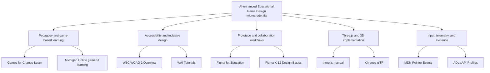
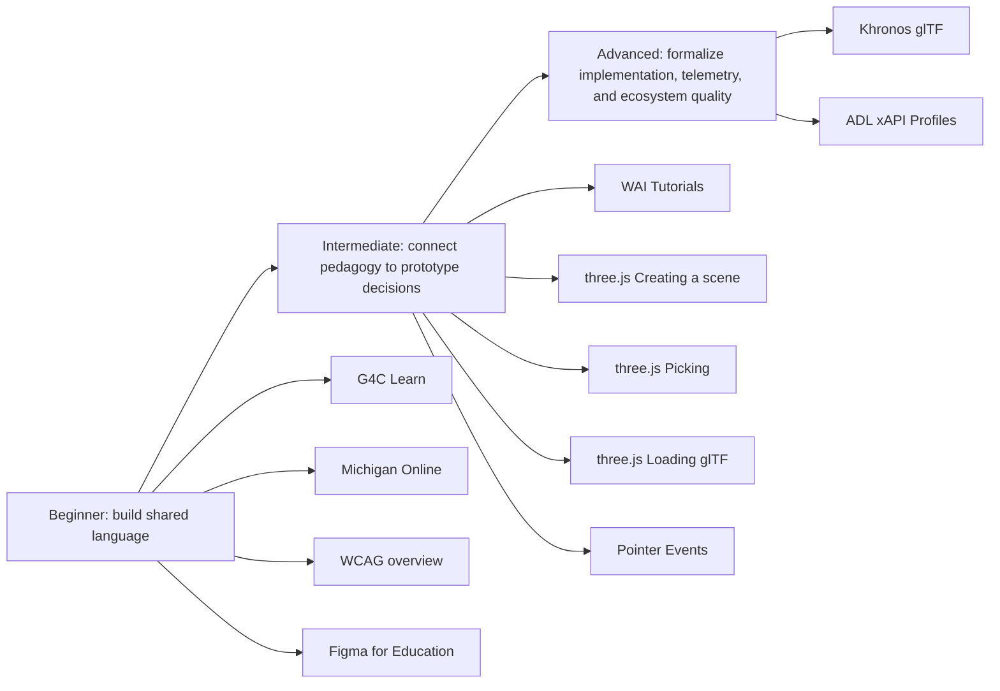

# Additional Learning Resources Guide

  
Facilitator Handout 07

  
<strong>Module Focus:</strong> selecting, sequencing, and assigning external learning resources that deepen the microcredential without overwhelming participants

  
<strong>Best Use:</strong> use this handout when building reading lists, optional enrichment pathways, studio preparation tasks, and implementation bridges for instructional designers, teachers, and educators

  
<strong>Atlas:</strong> <a href="/C:/Users/jewoo/Documents/Playground/educational-game-design-resource-pack-en/00-master-curriculum-atlas.md">Master Curriculum Atlas</a>

<table>
  <tr>
    <td style="background:#123B5D; color:#FFFFFF; padding:6px 10px;"><strong>[FRAME]</strong></td>
    <td style="background:#0F766E; color:#FFFFFF; padding:6px 10px;"><strong>[MAP]</strong></td>
    <td style="background:#A16207; color:#FFFFFF; padding:6px 10px;"><strong>[ACTION]</strong></td>
    <td style="background:#2F855A; color:#FFFFFF; padding:6px 10px;"><strong>[CHECK]</strong></td>
    <td style="background:#7C3AED; color:#FFFFFF; padding:6px 10px;"><strong>[EVIDENCE]</strong></td>
    <td style="background:#B42318; color:#FFFFFF; padding:6px 10px;"><strong>[RISK]</strong></td>
    <td style="background:#334155; color:#FFFFFF; padding:6px 10px;"><strong>[LINKS]</strong></td>
  </tr>
</table>

  <strong>Resource Design Lens</strong> 
  Do not treat outside resources as a decorative bibliography. Use them as targeted scaffolds: a resource should help participants think better, design better, test better, or implement more responsibly within a specific session.

## [FRAME] Purpose

This handout adds a curated external resource layer to the `AI-enhanced Educational Game Design` microcredential. It does three jobs at once:

- gives facilitators one verified place to find high-value external resources
- classifies those resources by `beginner`, `intermediate`, and `advanced` levels
- maps the resources into the `12-session standard model` and the `8-session compressed model`

The goal is not to make the course heavier. The goal is to make resource assignment more intentional.

## [FRAME] Who This Guide Supports

- instructional designers building structured learning pathways
- teachers adapting the microcredential for professional development or classroom innovation
- teacher educators and faculty designing workshop sequences
- museum, public learning, and informal learning facilitators
- project leads moving from pedagogy into prototype planning
- teams preparing for later Three.js implementation and testing work

## [FRAME] Verification Note

All external links in this handout were rechecked on `April 18, 2026` using official or primary-source pages where available.

## [MAP] External Resource Ecosystem

## [MAP] Level Progression Path

## [ACTION] Master Resource Index

| Resource | Provider | Primary Use | Best For | Level | Core or Optional | Official Link |
|---|---|---|---|---|---|---|
| G4C Learn | Games for Change | educator PD, social impact framing, curriculum inspiration | teachers, facilitators, curriculum designers | Beginner | Core | [gamesforchange.org/g4c-learn](https://www.gamesforchange.org/g4c-learn/) |
| G4C Student Challenge | Games for Change Learn | project framing, youth design challenge examples, game jam ideas | teachers, educators, youth program leads | Beginner | Optional | [learn.gamesforchange.org/student-challenge](https://learn.gamesforchange.org/student-challenge) |
| Leading Change: Go Beyond Gamification with Gameful Learning | Michigan Online | motivation theory, gameful learning, curriculum redesign | instructional designers, teachers, faculty | Beginner | Core | [online.umich.edu](https://online.umich.edu/courses/leading-change-go-beyond-gamification-with-gameful-learning/) |
| WCAG 2 Overview | W3C WAI | accessibility standards orientation | all participants | Beginner | Core | [w3.org/WAI/standards-guidelines/wcag](https://www.w3.org/WAI/standards-guidelines/wcag/) |
| WAI Tutorials | W3C WAI | practical accessibility implementation patterns | designers, facilitators, prototypers | Intermediate | Core | [w3.org/WAI/tutorials](https://www.w3.org/WAI/tutorials/) |
| Figma for Education | Figma | collaborative ideation and prototyping access | teachers, facilitators, prototyping teams | Beginner | Optional | [help.figma.com Figma for Education](https://help.figma.com/hc/en-us/articles/360041061214-Figma-for-Education) |
| K-12 Figma Design Basics | Figma | lightweight design literacy, prototyping basics, ready-made teaching modules | beginner teams, school-based implementations | Beginner | Optional | [figma.com/resource-library/k-12-design-basics](https://www.figma.com/resource-library/k-12-design-basics/) |
| Creating a Scene | three.js manual | basic mental model of scene, camera, renderer | beginner implementation teams | Beginner | Core for 3D track | [threejs.org/manual/en/creating-a-scene.html](https://threejs.org/manual/en/creating-a-scene.html) |
| Picking | three.js manual | interaction targeting and object selection | teams planning object interaction | Intermediate | Core for 3D track | [threejs.org/manual/en/picking.html](https://threejs.org/manual/en/picking.html) |
| Loading a .GLTF File | three.js manual | model-loading workflow and scene graph thinking | teams using real 3D assets | Intermediate | Core for 3D track | [threejs.org/manual/en/load-gltf.html](https://threejs.org/manual/en/load-gltf.html) |
| glTF Runtime 3D Asset Delivery | Khronos Group | asset pipeline literacy, validation, optimization, standard vocabulary | advanced 3D teams | Advanced | Optional to Core depending on scope | [khronos.org/gltf](https://www.khronos.org/gltf/) |
| Pointer Events | MDN | cross-device input model for mouse, pen, and touch | simulation and web interaction teams | Intermediate | Core for browser prototype track | [developer.mozilla.org Pointer events](https://developer.mozilla.org/en-US/docs/Web/API/Pointer_events) |
| xAPI Profiles | ADL | structured event semantics, telemetry planning, evidence architecture | advanced QA, analytics, and research-oriented teams | Advanced | Optional | [adlnet.gov Profiles guide](https://www.adlnet.gov/guides/xapi-profile-server/user-guide/Profiles.html) |

## [ACTION] What To Assign First By Participant Type

| Participant Type | Start Here | Add Next | Add Later If Needed |
|---|---|---|---|
| instructional designers | Michigan Online, WCAG 2 Overview | WAI Tutorials, G4C Learn | xAPI Profiles, three.js manual |
| teachers and facilitators | G4C Learn, Michigan Online | G4C Student Challenge, Figma for Education | WCAG tutorials, Three.js track |
| educators new to prototyping | Figma for Education, K-12 Figma Design Basics | WCAG 2 Overview, WAI Tutorials | Pointer Events, Three.js track |
| teams targeting Three.js | Creating a Scene | Picking, Loading a .GLTF File | Khronos glTF, Pointer Events, xAPI Profiles |
| teams preparing evaluation and formal testing | WCAG 2 Overview | WAI Tutorials, Pointer Events | xAPI Profiles |

## [ACTION] Beginner Pathway

Use this pathway when participants need a common language before they can make good design or implementation decisions.

| Order | Resource | Why It Belongs Early | Suggested Use |
|---|---|---|---|
| 1 | Michigan Online gameful learning | frames why gameful environments support autonomy, competence, and relatedness | assign selected overview pages or short excerpts for session discussion |
| 2 | G4C Learn | broadens the field beyond entertainment and points to educator-facing practice | use as inspiration before concept generation |
| 3 | WCAG 2 Overview | prevents accessibility from becoming a last-minute compliance issue | assign before prototype criteria are finalized |
| 4 | Figma for Education | gives low-risk collaboration and visualization entry points | use before asking teams to produce interface or flow artifacts |
| 5 | K-12 Figma Design Basics | helps less technical participants make visible artifacts quickly | assign as optional skill-up practice |

## [ACTION] Intermediate Pathway

Use this pathway when teams already understand the pedagogical frame and now need to connect design intent to interaction decisions.

| Order | Resource | Why It Belongs Here | Suggested Use |
|---|---|---|---|
| 1 | WAI Tutorials | turns accessibility principles into design actions | pair with prototype critique |
| 2 | Creating a Scene | establishes the minimum Three.js mental model | assign before any scene planning |
| 3 | Picking | clarifies how user action maps to scene interaction | use when interactive objects are being specified |
| 4 | Loading a .GLTF File | prepares teams to work with real assets and scene graphs | assign before importing external models |
| 5 | Pointer Events | supports device-agnostic interaction planning | use when browser prototypes must work across touch, pen, and mouse |

## [ACTION] Advanced Pathway

Use this pathway when teams are no longer only designing an experience and are beginning to design a technical system.

| Order | Resource | Why It Belongs Later | Suggested Use |
|---|---|---|---|
| 1 | Khronos glTF | requires a meaningful asset workflow to matter | assign once teams move beyond placeholder objects |
| 2 | xAPI Profiles | useful only when evidence questions are stable enough to formalize | assign for research, rigorous QA, or learning analytics extension work |

## [EVIDENCE] Resource-To-Handout Alignment

| External Resource | Best Matching Internal Handout | Integration Logic |
|---|---|---|
| G4C Learn, G4C Student Challenge | [02-worked-examples-casebook.md](</C:/Users/jewoo/Documents/Playground/educational-game-design-resource-pack-en/02-worked-examples-casebook.md>) | expands the range of authentic game-based learning examples and challenge structures |
| Michigan Online gameful learning | [01-teacher-digital-curriculum-guide.md](</C:/Users/jewoo/Documents/Playground/educational-game-design-resource-pack-en/01-teacher-digital-curriculum-guide.md>) | strengthens motivational and curriculum framing for facilitators |
| WCAG 2 Overview, WAI Tutorials | [06-technical-qa-and-data-logging-checklists.md](</C:/Users/jewoo/Documents/Playground/educational-game-design-resource-pack-en/06-technical-qa-and-data-logging-checklists.md>) | grounds accessibility and usability criteria in recognized standards |
| Figma for Education, K-12 Figma Design Basics | [03-playtesting-toolkit.md](</C:/Users/jewoo/Documents/Playground/educational-game-design-resource-pack-en/03-playtesting-toolkit.md>) | supports quicker prototyping cycles and clearer artifacts for early testing |
| three.js manual pages | [05-threejs-foundations-learning-pack.md](</C:/Users/jewoo/Documents/Playground/educational-game-design-resource-pack-en/05-threejs-foundations-learning-pack.md>) | turns pedagogical concepts into concrete implementation vocabulary |
| Khronos glTF | [05-threejs-foundations-learning-pack.md](</C:/Users/jewoo/Documents/Playground/educational-game-design-resource-pack-en/05-threejs-foundations-learning-pack.md>) | supports asset-format literacy and sustainable 3D workflows |
| Pointer Events, xAPI Profiles | [06-technical-qa-and-data-logging-checklists.md](</C:/Users/jewoo/Documents/Playground/educational-game-design-resource-pack-en/06-technical-qa-and-data-logging-checklists.md>) | deepens cross-device interaction quality and formal telemetry planning |

## [ACTION] 12-Session Standard Model: External Resource Map

The standard model below matches the `12-session` microcredential structure defined in the Korean master document.

| Session | Focus | External Resource Assignment | Level | Why This Resource Fits Here | Suggested Output |
|---|---|---|---|---|---|
| 1 | Why educational game design | Michigan Online gameful learning overview | Beginner | establishes the difference between superficial gamification and deeper gameful learning | short reflection on why this project should or should not be a game |
| 2 | Learner and context analysis | G4C Learn | Beginner | shows how social context, civic context, and youth voice can shape design problems | learner-context note with one design implication |
| 3 | Aligning learning goals and game goals | G4C Student Challenge or selected G4C examples | Beginner | helps participants inspect how design prompts shape game goals | alignment table comparing learning goal and core loop |
| 4 | Mechanics literacy I | Michigan Online plus one case from G4C | Beginner | connects motivation and mechanics language | annotated mechanic list tied to learner action |
| 5 | Mechanics literacy II | Figma for Education or K-12 Design Basics | Beginner | supports low-stakes visualization of interaction, role, or narrative flow | rough interface or flow draft |
| 6 | Teacher or facilitator design | WCAG 2 Overview | Beginner | reminds teams that facilitation quality and access conditions shape learning quality | facilitator move plan plus one accessibility commitment |
| 7 | Low-fidelity prototyping | Figma for Education or K-12 Design Basics | Beginner | helps teams visualize systems without overbuilding | low-fidelity prototype board or screen sequence |
| 8 | Mid-fidelity interaction design | WAI Tutorials | Intermediate | turns inclusion into concrete design decisions before higher-fidelity work | revised prototype with accessibility changes documented |
| 9 | Playtesting and learning data | Pointer Events | Intermediate | sharpens thinking about what inputs are actually supported in browser-based prototypes | playtest plan that names supported devices and input assumptions |
| 10 | Ethics, accessibility, cognitive load, fairness | WAI Tutorials plus WCAG 2 Overview revisit | Intermediate | grounds ethical critique in implementation detail rather than generic good intentions | ethics and accessibility risk log |
| 11 | Capstone studio revision | Creating a Scene, Picking, or Loading a .GLTF File depending on track | Beginner to Intermediate | provides just-in-time implementation thinking without forcing all teams into code | revised technical concept note or scene plan |
| 12 | Final presentation and review | Khronos glTF or xAPI Profiles for advanced teams only | Advanced | supports teams ready to discuss asset workflow or evidence architecture credibly | implementation roadmap or telemetry extension note |

## [ACTION] 8-Session Compressed Model: External Resource Map

Use this mapping when the course is delivered in the minimum `8-session` compressed format.

| Compressed Session | Standard Session Merge | External Resource Priority | Assignment Logic |
|---|---|---|---|
| 1 | sessions 1-2 | Michigan Online plus G4C Learn | frame the problem, the learner, and the value of gameful learning together |
| 2 | session 3 | G4C examples or Student Challenge | focus tightly on learning-goal and game-goal alignment |
| 3 | sessions 4-5 | Figma for Education or K-12 Design Basics | support visible design work without requiring code |
| 4 | session 6 | WCAG 2 Overview | make facilitation and inclusion non-optional before prototyping accelerates |
| 5 | sessions 7-8 | WAI Tutorials | improve prototype quality before testing begins |
| 6 | session 9 | Pointer Events | clarify supported inputs and interaction assumptions for testing |
| 7 | session 10 | WAI Tutorials revisit | focus the ethics and accessibility critique on real design choices |
| 8 | sessions 11-12 | three.js manual pages, then optional Khronos or xAPI extensions | give implementation-minded teams a next-step bridge without burdening all participants |

## [ACTION] Recommended Reading Load Rules

To keep the microcredential coherent, use these pacing rules.

1. Assign `one core external resource` for most sessions, not three or four.
2. Use `optional extension resources` only for teams whose project scope justifies them.
3. If a team is struggling with concept clarity, assign pedagogy resources before technical ones.
4. If a team is struggling with usability or access, assign accessibility resources before visual polish work.
5. If a team is attracted to 3D for prestige reasons, ask them to justify 3D before assigning technical implementation readings.

## [RISK] Common Failure Modes When Using External Resources

| Failure Mode | What It Looks Like | Why It Happens | Mitigation |
|---|---|---|---|
| resource overload | participants skim many links but use none well | readings are assigned without a clear decision task | tie every reading to a visible artifact or question |
| false rigor | the bibliography grows but design quality does not | resources are cited performatively, not operationally | ask what changed in the prototype because of the reading |
| theory drift | participants stay in abstract pedagogy and avoid design commitments | theory is assigned without a making task | pair theory with a design move or critique task |
| premature technical escalation | teams jump into Three.js before validating the learning loop | technical readings arrive before design assumptions are tested | gate technical resources behind evidence of concept clarity |
| accessibility tokenism | teams mention inclusion but change nothing concrete | accessibility is framed as ethics-only language | require one documented accessibility revision before review |
| analytics theater | teams log events they cannot interpret | telemetry is assigned before evidence questions stabilize | define the learning question first, then define the event |

## [ACTION] Mitigation Strategies For Facilitators

| If You Notice... | Then Do This |
|---|---|
| teams are citing resources without changing artifacts | require a `before reading / after reading` delta note |
| teams are anxious about technical materials | shift them back to Figma, facilitation, and playtesting artifacts first |
| teams want to use every optional resource | force a priority ranking of no more than two external resources per milestone |
| teams are using accessibility language vaguely | ask them to identify one specific barrier and one design response |
| teams are over-focusing on advanced logging | have them write the one decision the data must support before adding any event taxonomy |

## [CHECK] Critical Thinking Prompts For Resource Use

- Which assigned resource actually changed a design decision, and which one only changed the language used to describe the design?
- What would become weaker if this team skipped the technical resources entirely for one more week?
- Which resource is most likely to create false confidence because it looks authoritative but is being used too early?
- Are we assigning this resource because it is useful now, or because it is well known in the field?
- What accessibility issue would remain invisible if we used only pedagogical resources and skipped implementation-oriented guidance?
- What evidence would tell us that an advanced resource such as `xAPI Profiles` is justified rather than premature?

## [LINKS] Official Source List

- Games for Change Learn: [https://www.gamesforchange.org/g4c-learn/](https://www.gamesforchange.org/g4c-learn/)
- G4C Student Challenge: [https://learn.gamesforchange.org/student-challenge](https://learn.gamesforchange.org/student-challenge)
- Michigan Online gameful learning course: [https://online.umich.edu/courses/leading-change-go-beyond-gamification-with-gameful-learning/](https://online.umich.edu/courses/leading-change-go-beyond-gamification-with-gameful-learning/)
- W3C WCAG 2 Overview: [https://www.w3.org/WAI/standards-guidelines/wcag/](https://www.w3.org/WAI/standards-guidelines/wcag/)
- W3C WAI Tutorials: [https://www.w3.org/WAI/tutorials/](https://www.w3.org/WAI/tutorials/)
- Figma for Education help center: [https://help.figma.com/hc/en-us/articles/360041061214-Figma-for-Education](https://help.figma.com/hc/en-us/articles/360041061214-Figma-for-Education)
- Figma K-12 Design Basics: [https://www.figma.com/resource-library/k-12-design-basics/](https://www.figma.com/resource-library/k-12-design-basics/)
- three.js Creating a Scene: [https://threejs.org/manual/en/creating-a-scene.html](https://threejs.org/manual/en/creating-a-scene.html)
- three.js Picking: [https://threejs.org/manual/en/picking.html](https://threejs.org/manual/en/picking.html)
- three.js Loading a .GLTF File: [https://threejs.org/manual/en/load-gltf.html](https://threejs.org/manual/en/load-gltf.html)
- Khronos glTF: [https://www.khronos.org/gltf/](https://www.khronos.org/gltf/)
- MDN Pointer Events: [https://developer.mozilla.org/en-US/docs/Web/API/Pointer_events](https://developer.mozilla.org/en-US/docs/Web/API/Pointer_events)
- ADL xAPI Profiles guide: [https://www.adlnet.gov/guides/xapi-profile-server/user-guide/Profiles.html](https://www.adlnet.gov/guides/xapi-profile-server/user-guide/Profiles.html)

## [LINKS] Internal Navigation

- [00-master-curriculum-atlas.md](</C:/Users/jewoo/Documents/Playground/educational-game-design-resource-pack-en/00-master-curriculum-atlas.md>)
- [01-teacher-digital-curriculum-guide.md](</C:/Users/jewoo/Documents/Playground/educational-game-design-resource-pack-en/01-teacher-digital-curriculum-guide.md>)
- [02-worked-examples-casebook.md](</C:/Users/jewoo/Documents/Playground/educational-game-design-resource-pack-en/02-worked-examples-casebook.md>)
- [03-playtesting-toolkit.md](</C:/Users/jewoo/Documents/Playground/educational-game-design-resource-pack-en/03-playtesting-toolkit.md>)
- [04-portfolio-exemplar-set.md](</C:/Users/jewoo/Documents/Playground/educational-game-design-resource-pack-en/04-portfolio-exemplar-set.md>)
- [05-threejs-foundations-learning-pack.md](</C:/Users/jewoo/Documents/Playground/educational-game-design-resource-pack-en/05-threejs-foundations-learning-pack.md>)
- [06-technical-qa-and-data-logging-checklists.md](</C:/Users/jewoo/Documents/Playground/educational-game-design-resource-pack-en/06-technical-qa-and-data-logging-checklists.md>)
