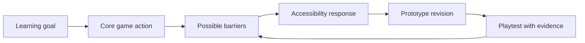
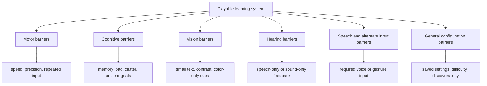

# Game Accessibility Playbook

  
Facilitator Handout 08

  
<strong>Module Focus:</strong> game-specific accessibility design, review, and iteration practices for educational games and simulations

  
<strong>Best Use:</strong> use this handout when teams are turning learning goals into playable systems and need concrete inclusive design criteria beyond general web accessibility language

  
<strong>Atlas:</strong> <a href="/C:/Users/jewoo/Documents/Playground/educational-game-design-resource-pack-en/00-master-curriculum-atlas.md">Master Curriculum Atlas</a>

<table>
  <tr>
    <td style="background:#123B5D; color:#FFFFFF; padding:6px 10px;"><strong>[FRAME]</strong></td>
    <td style="background:#0F766E; color:#FFFFFF; padding:6px 10px;"><strong>[MAP]</strong></td>
    <td style="background:#A16207; color:#FFFFFF; padding:6px 10px;"><strong>[ACTION]</strong></td>
    <td style="background:#2F855A; color:#FFFFFF; padding:6px 10px;"><strong>[CHECK]</strong></td>
    <td style="background:#7C3AED; color:#FFFFFF; padding:6px 10px;"><strong>[EVIDENCE]</strong></td>
    <td style="background:#B42318; color:#FFFFFF; padding:6px 10px;"><strong>[RISK]</strong></td>
    <td style="background:#334155; color:#FFFFFF; padding:6px 10px;"><strong>[LINKS]</strong></td>
  </tr>
</table>

  <strong>Access Lens</strong> 
  Accessibility is not a repair layer added after the prototype is already fixed in form. It is a design logic that changes mechanics, feedback, pacing, input expectations, and what counts as successful participation.

## [FRAME] Purpose

This handout helps facilitators and design teams apply `game-specific accessibility` criteria to educational games, simulations, and interactive prototypes. It complements general accessibility resources such as `WCAG` and `WAI Tutorials`, but goes further into issues that appear strongly in playable systems:

- input complexity
- timing pressure
- text readability under play conditions
- tutorial clarity
- configurable difficulty
- multi-sensory feedback
- interaction targets on mouse, touch, and controller-like interfaces

## [FRAME] Why This Handout Is Needed

Educational game teams often make one of two mistakes:

- they assume that passing a generic web accessibility checklist means the game is accessible
- they assume accessibility can be postponed until after the “real design” is done

Neither assumption holds. A game can have readable buttons and still be inaccessible because it depends on:

- rapid repeated input
- color-only signaling
- tiny interaction targets
- high visual clutter
- forced timing
- audio-only cues
- overcomplicated control schemes

## [MAP] Accessibility Review Loop

## [MAP] Barrier Types In Educational Games

## [ACTION] Accessibility Principles To Teach Early

Use these as `studio rules`, not just review criteria.

1. `No essential learning signal should rely on one sensory channel only`
2. `No essential action should require one single fixed input method`
3. `No major learning step should depend on unnecessary speed pressure`
4. `No player should need advanced prior gaming literacy just to begin`
5. `Settings should be remembered and easy to revisit`

## [ACTION] Quick-Start Checklist For Early Prototypes

| Area | Minimum Good Practice | Why It Matters |
|---|---|---|
| text | use a clearly readable size and formatting | educational prototypes fail quickly when prompts and feedback are hard to parse |
| controls | allow simplified input or alternative mappings where possible | rigid control schemes exclude learners unnecessarily |
| color | never use fixed color alone for essential information | many learners will miss meaning if color is the only carrier |
| audio | ensure essential information is not conveyed by sound alone | learning should remain legible in silent or noisy conditions |
| timing | allow learners to progress prompts at their own pace when possible | reflection and understanding often need more time than action games assume |
| tutorials | include clear interactive guidance | educational games often introduce both content and interaction rules at once |
| difficulty | offer more than one challenge level or support mode | instructional value collapses if the challenge gate is too rigid |
| settings | save and remember accessibility-related settings | repeated reconfiguration discourages sustained use |

## [ACTION] Barrier Review By Domain

### Motor

Review for:

- repeated button presses
- precise drag actions
- simultaneous actions
- small click or touch targets
- hold-to-act mechanics
- fast cursor travel demands

Mitigation ideas:

- remappable controls
- larger hit areas
- toggle instead of hold
- adjustable sensitivity
- slower interaction mode

### Cognitive

Review for:

- unclear objectives
- cluttered screens
- inconsistent symbols
- excessive menu depth
- overloaded HUDs
- tutorial text that appears once and disappears

Mitigation ideas:

- persistent objective reminders
- simple language
- chunked information
- fewer simultaneous demands
- re-openable help layer

### Vision

Review for:

- small fonts
- weak contrast
- crowded overlays
- critical meaning shown by color alone
- difficult-to-locate interactive elements
- motion or camera settings that increase discomfort

Mitigation ideas:

- stronger contrast
- readable default font size
- non-color indicators
- highlight or label interactive objects
- careful default field of view in 3D scenes

### Hearing

Review for:

- missing subtitles or captions
- sound-only alerts
- unbalanced audio mix
- gameplay that assumes spoken instructions are always heard

Mitigation ideas:

- subtitles for important speech
- visual duplicates for sound cues
- separate volume controls
- visible state changes when alerts occur

### Speech And Alternate Input

Review for:

- required speech input
- gesture-only interaction
- inaccessible alternate input assumptions

Mitigation ideas:

- never require speech as the only path
- allow digital control equivalents
- treat speech and motion as optional enhancement layers

## [ACTION] Educational Game Accessibility Heuristics

| Heuristic | Good Signal | Warning Sign |
|---|---|---|
| accessible entry | learners can begin without hidden gaming literacy | the first five minutes already assume genre familiarity |
| readable feedback | players can tell what happened and why | feedback is flashy but semantically unclear |
| recoverable mistakes | failure teaches and allows retry | one mistake leads to confusion or dead-end frustration |
| configurable challenge | support is adjustable | one fixed difficulty path governs all learners |
| inclusive evidence | success can be demonstrated in more than one way | the system rewards speed or precision more than understanding |

## [EVIDENCE] What To Look For In Playtests

Do not ask only “was it accessible?” Gather specific evidence.

| Evidence Type | What To Observe | What It May Mean |
|---|---|---|
| hesitation at start | learner cannot tell how to begin | onboarding or tutorial barrier |
| repeated failed inputs | learner understands the goal but cannot execute it | motor or interface barrier |
| missed cues | learner does not notice key prompts | visual, audio, or attention barrier |
| abandoned attempt | learner stops before content-level engagement begins | barrier is blocking access before learning |
| workaround behavior | learner invents a different path to participate | useful signal for needed alternative interaction |

## [ACTION] Facilitation Moves During Accessibility Review

Use questions like:

- What is the smallest interaction that might exclude someone here?
- What assumption about player ability is hidden in this mechanic?
- If the audio disappeared, what learning signal would remain?
- If the learner had half the cursor precision, could they still succeed?
- If the learner needed more time, would the system still teach rather than punish?

## [RISK] Common Accessibility Failure Modes

| Failure Mode | What It Looks Like | Why It Happens | Mitigation |
|---|---|---|---|
| accessibility by checklist only | teams confirm contrast and alt text but ignore mechanics | review stays at interface level | add mechanic-level review questions |
| “optional later” thinking | access features are postponed indefinitely | team sees them as polish | make accessibility part of prototype exit criteria |
| genre bias | designers assume “players will know this” | prior gaming literacy is mistaken for usability | test with non-gamers and educators |
| support stigma | support options feel like “easy mode shame” | challenge is framed as moral worth | present support as legitimate learner configuration |
| hidden barriers in teaching flow | the game is accessible but the debrief is not | facilitator layer is ignored | review the whole learning experience, not only the software |

## [ACTION] Mitigation Strategy Table

| If The Problem Is... | Try This First | Then Try This |
|---|---|---|
| learners miss critical objects | add labels, contrast, and non-color indicators | simplify scene clutter and adjust camera framing |
| learners fail due to timing | slow the pace or allow pause | redesign the mechanic so comprehension matters more than speed |
| text is ignored or unreadable | shorten text and improve formatting | move some explanation into step-by-step interactive guidance |
| controls are too demanding | simplify inputs and enlarge targets | add remapping or alternative control paths |
| settings are not used | place them up front and save them automatically | add a replayable access setup screen |

## [CHECK] Review Questions Before Sign-Off

- Which learner might fail here for reasons unrelated to the intended learning challenge?
- What feature currently rewards reflexes, perception speed, or gaming familiarity more than understanding?
- Which support options are available only to learners who already know where to look?
- Are we designing challenge, or are we accidentally designing avoidable exclusion?
- What accessibility improvement would most increase educational validity, not just usability?

## [LINKS] Official References

- Game Accessibility Guidelines home: [https://gameaccessibilityguidelines.com/](https://gameaccessibilityguidelines.com/)
- Why and how: [https://gameaccessibilityguidelines.com/why-and-how/](https://gameaccessibilityguidelines.com/why-and-how/)
- Basic guidelines: [https://gameaccessibilityguidelines.com/basic/](https://gameaccessibilityguidelines.com/basic/)
- Full list: [https://gameaccessibilityguidelines.com/full-list/](https://gameaccessibilityguidelines.com/full-list/)
- W3C WCAG 2 Overview: [https://www.w3.org/WAI/standards-guidelines/wcag/](https://www.w3.org/WAI/standards-guidelines/wcag/)
- W3C WAI Tutorials: [https://www.w3.org/WAI/tutorials/](https://www.w3.org/WAI/tutorials/)

## [LINKS] Internal Navigation

- [06-technical-qa-and-data-logging-checklists.md](</C:/Users/jewoo/Documents/Playground/educational-game-design-resource-pack-en/06-technical-qa-and-data-logging-checklists.md>)
- [07-additional-learning-resources.md](</C:/Users/jewoo/Documents/Playground/educational-game-design-resource-pack-en/07-additional-learning-resources.md>)
- [00-master-curriculum-atlas.md](</C:/Users/jewoo/Documents/Playground/educational-game-design-resource-pack-en/00-master-curriculum-atlas.md>)
