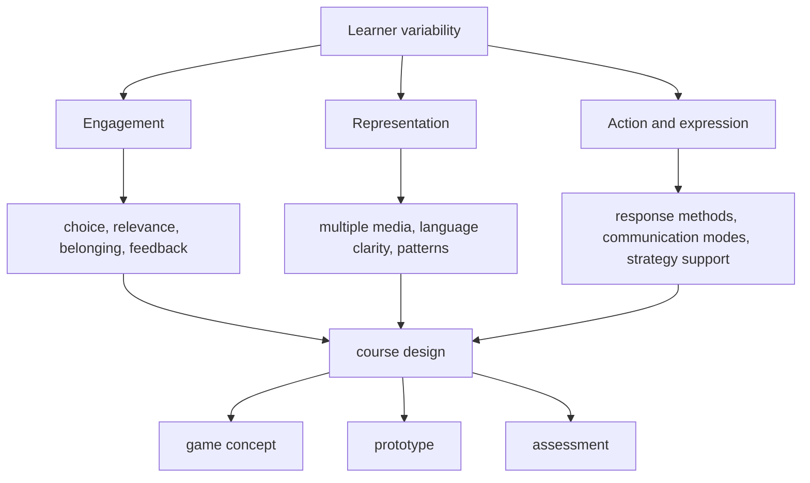
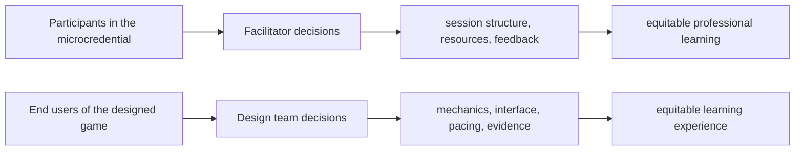

# UDL 3.0 Crosswalk

  
Facilitator Handout 09

  
<strong>Module Focus:</strong> applying CAST UDL Guidelines 3.0 across the microcredential, the design studio, and project assessment process

  
<strong>Best Use:</strong> use this handout when you want inclusion, learner variability, and equitable participation to shape the course design itself rather than appear only in a final ethics discussion

  
<strong>Atlas:</strong> <a href="/C:/Users/jewoo/Documents/Playground/educational-game-design-resource-pack-en/00-master-curriculum-atlas.md">Master Curriculum Atlas</a>

<table>
  <tr>
    <td style="background:#123B5D; color:#FFFFFF; padding:6px 10px;"><strong>[FRAME]</strong></td>
    <td style="background:#0F766E; color:#FFFFFF; padding:6px 10px;"><strong>[MAP]</strong></td>
    <td style="background:#A16207; color:#FFFFFF; padding:6px 10px;"><strong>[ACTION]</strong></td>
    <td style="background:#2F855A; color:#FFFFFF; padding:6px 10px;"><strong>[CHECK]</strong></td>
    <td style="background:#7C3AED; color:#FFFFFF; padding:6px 10px;"><strong>[EVIDENCE]</strong></td>
    <td style="background:#B42318; color:#FFFFFF; padding:6px 10px;"><strong>[RISK]</strong></td>
    <td style="background:#334155; color:#FFFFFF; padding:6px 10px;"><strong>[LINKS]</strong></td>
  </tr>
</table>

  <strong>Equity Lens</strong> 
  UDL is not a decorative inclusion statement. It is a design discipline for anticipating learner variability and reducing barriers before learners are labeled as the problem.

## [FRAME] Purpose

This handout translates `CAST UDL Guidelines 3.0` into a working crosswalk for the `Educational Game Design` microcredential. It helps facilitators ask:

- where variability is expected
- where barriers are likely
- how participation can remain rigorous without being rigid
- how course design, artifact design, and prototype design should reinforce one another

## [FRAME] Why UDL Matters In This Microcredential

This course asks participants to:

- analyze learners
- design playful systems
- critique ethical implications
- test prototypes
- present and justify decisions

That means `learner variability` exists at two levels at once:

1. the participants in the microcredential vary in background, confidence, and technical experience
2. the learners those participants are designing for also vary in identity, context, access needs, and prior experience

UDL helps keep both levels visible.

## [MAP] UDL 3.0 In The Course System

## [MAP] Dual UDL Lens

## [ACTION] The Three UDL Questions

### Engagement

How are we designing for interest, belonging, persistence, and meaningful challenge?

### Representation

How are we presenting ideas, patterns, language, and feedback in ways that reduce avoidable barriers?

### Action And Expression

How are we allowing learners to respond, construct, communicate, and demonstrate understanding through more than one path?

## [ACTION] 12-Session UDL Crosswalk

| Session | Main Focus | Engagement Lens | Representation Lens | Action and Expression Lens |
|---|---|---|---|---|
| 1 | why educational game design | build relevance and identity connection to the field | clarify key terms and misconceptions | allow multiple ways to respond to “why a game?” |
| 2 | learner and context analysis | surface real learner interests and contexts | represent context with multiple data forms | allow varied analysis artifacts such as notes, maps, and personas |
| 3 | learning-goal and game-goal alignment | make purpose explicit | visualize alignment clearly | let teams defend alignment using tables, diagrams, or short narratives |
| 4 | mechanics literacy I | sustain curiosity through examples and comparisons | illustrate mechanics through multiple cases | allow teams to classify mechanics in more than one format |
| 5 | mechanics literacy II | support collaboration and imagination | use storyboards, role maps, and flow diagrams | allow role, narrative, or system-based expression |
| 6 | teacher facilitation design | strengthen belonging and support | present facilitation models clearly | allow teams to draft teacher guides in multiple templates |
| 7 | low-fidelity prototyping | reduce risk of perfectionism and fear | use sketches, boards, and lightweight diagrams | validate many prototype forms, not one required format |
| 8 | mid-fidelity interaction design | keep challenge productive, not punishing | clarify state changes and interface meaning | allow teams to show interaction logic visually and textually |
| 9 | playtesting and data | frame feedback as growth, not judgment | represent findings with notes, tables, and traces | allow evidence interpretation through multiple review formats |
| 10 | ethics, accessibility, fairness | foreground belonging and bias awareness | show barriers across different learner identities | allow redesign proposals in different media |
| 11 | capstone studio revision | support persistence under deadline | keep priorities visible | allow justified scope reductions and alternative artifact strengths |
| 12 | final presentation | reduce unnecessary presentation gatekeeping | make evaluation criteria transparent | allow multiple evidence types in the final defense |

## [ACTION] Artifact-Level UDL Crosswalk

| Artifact | Engagement Questions | Representation Questions | Action and Expression Questions |
|---|---|---|---|
| design brief | does the problem feel meaningful and authentic | are goals and constraints clear | can teams define the problem in their own justified way |
| prototype | does the experience invite persistence without coercion | are cues legible and multimodal | can learners act through more than one reasonable pathway |
| teacher guide | does facilitation support belonging and relevance | are instructions and prompts understandable | can teachers adapt the experience without breaking it |
| playtest report | does the report value revision and learning | are findings visible and interpretable | can evidence be shown through tables, clips, notes, and logs |
| final portfolio | does the narrative make purpose visible | are claims backed with clear artifacts | can quality be demonstrated by more than polish alone |

## [ACTION] Facilitator Design Moves Aligned To UDL 3.0

| If You Want To Strengthen... | Try These Moves |
|---|---|
| choice and autonomy | offer more than one artifact format where the learning target allows it |
| relevance and authenticity | connect each session to a real teaching, training, or public-learning problem |
| belonging and community | use critique protocols that challenge the work without shaming the learner |
| multiple ways to perceive information | pair spoken explanation with diagrams, examples, and written prompts |
| multiple ways to communicate | accept maps, concept boards, matrices, scripts, and annotated prototypes |
| strategy development | ask teams to identify one barrier, one tradeoff, and one next revision move every session |

## [EVIDENCE] Signs That UDL Is Actually Being Used

| Strong Signal | Weak Signal |
|---|---|
| course instructions are transparent and flexible where appropriate | “inclusive” appears only in a mission statement |
| teams can choose among equivalent artifact forms | one rigid format governs every demonstration of learning |
| feedback helps learners plan next steps | feedback only judges completed quality |
| game concepts account for varied learners early | access and variability appear only in the final review |
| assessment rewards justified design reasoning | assessment rewards polish and confidence performance only |

## [RISK] Misuses Of UDL In This Context

| Misuse | What It Looks Like | Why It Is A Problem | Mitigation |
|---|---|---|---|
| UDL as simplification | rigor is reduced instead of barriers being reduced | learners get less challenge, not better access | separate `support` from `lowered expectations` |
| UDL as optional add-on | crosswalk appears in one lecture only | inclusion never shapes actual design work | use UDL prompts in weekly critique |
| UDL as format inflation | teams produce many media types without clearer thinking | variety replaces coherence | require justified representation choices |
| UDL as individual accommodation only | variability is treated case by case after problems appear | the design remains fundamentally rigid | redesign the environment and artifacts first |

## [ACTION] Mitigation Strategies

| If You Notice... | Then Do This |
|---|---|
| participants read UDL as “make it easier” | reframe it as “make the challenge meaningful and the barrier negotiable” |
| teams only mention accessibility at session 10 | require a barrier note in sessions 2, 5, 7, and 9 as well |
| critique favors verbal confidence | require visual or written evidence alongside oral defense |
| one artifact format is dominating unnecessarily | publish a menu of equivalent evidence formats |

## [CHECK] Critical Thinking Prompts

- Which part of this session is difficult because of the intended intellectual challenge, and which part is difficult because of avoidable course design friction?
- Where are we confusing standardization with fairness?
- What learner identity or context is currently invisible in this design conversation?
- Does this prototype require one “ideal” user, or can different learners still demonstrate meaningful engagement?
- What would a more UDL-aligned final review look like without lowering standards?

## [LINKS] Official References

- CAST UDL Guidelines 3.0: [https://udlguidelines.cast.org/](https://udlguidelines.cast.org/)
- About the 3.0 update: [https://udlguidelines.cast.org/more/about-guidelines-3-0/](https://udlguidelines.cast.org/more/about-guidelines-3-0/)
- Downloads and organizer: [https://udlguidelines.cast.org/more/downloads/](https://udlguidelines.cast.org/more/downloads/)

## [LINKS] Internal Navigation

- [01-teacher-digital-curriculum-guide.md](</C:/Users/jewoo/Documents/Playground/educational-game-design-resource-pack-en/01-teacher-digital-curriculum-guide.md>)
- [08-game-accessibility-playbook.md](</C:/Users/jewoo/Documents/Playground/educational-game-design-resource-pack-en/08-game-accessibility-playbook.md>)
- [00-master-curriculum-atlas.md](</C:/Users/jewoo/Documents/Playground/educational-game-design-resource-pack-en/00-master-curriculum-atlas.md>)
