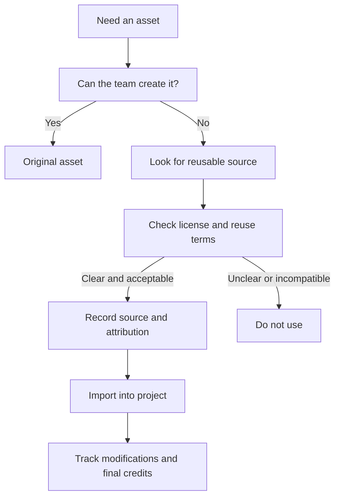
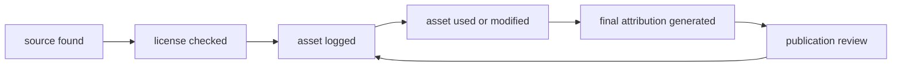

# Asset Licensing And Attribution Pack

  
Facilitator Handout 10

  
<strong>Module Focus:</strong> licensing, attribution, reuse decisions, and asset tracking for images, audio, video, and 3D media used in educational game projects

  
<strong>Best Use:</strong> use this handout before teams begin importing outside assets or publishing final artifacts, especially when students or educators assume that “free online” means reusable

  
<strong>Atlas:</strong> <a href="/C:/Users/jewoo/Documents/Playground/educational-game-design-resource-pack-en/00-master-curriculum-atlas.md">Master Curriculum Atlas</a>

<table>
  <tr>
    <td style="background:#123B5D; color:#FFFFFF; padding:6px 10px;"><strong>[FRAME]</strong></td>
    <td style="background:#0F766E; color:#FFFFFF; padding:6px 10px;"><strong>[MAP]</strong></td>
    <td style="background:#A16207; color:#FFFFFF; padding:6px 10px;"><strong>[ACTION]</strong></td>
    <td style="background:#2F855A; color:#FFFFFF; padding:6px 10px;"><strong>[CHECK]</strong></td>
    <td style="background:#7C3AED; color:#FFFFFF; padding:6px 10px;"><strong>[EVIDENCE]</strong></td>
    <td style="background:#B42318; color:#FFFFFF; padding:6px 10px;"><strong>[RISK]</strong></td>
    <td style="background:#334155; color:#FFFFFF; padding:6px 10px;"><strong>[LINKS]</strong></td>
  </tr>
</table>

  <strong>Rights Lens</strong> 
  Strong projects do not only look polished. They can also explain where every external asset came from, what the reuse terms are, and how attribution or redistribution obligations were handled.

## [FRAME] Purpose

This handout gives facilitators and project teams a practical framework for handling:

- image and audio reuse
- icon and UI asset sourcing
- 3D model and texture reuse
- attribution formatting
- student and educator publication decisions
- asset provenance tracking

It is designed for educational contexts where teams often combine original work with openly licensed, institutionally licensed, or borrowed reference materials.

## [FRAME] Core Principles

1. `Findable is not reusable`
2. `Openly licensed is not the same as no conditions`
3. `Attribution needs documentation, not memory`
4. `Student teams should track source information at the moment of download, not at the end`
5. `Software licenses and media licenses are not interchangeable`

## [MAP] Asset Decision Flow

## [MAP] Asset Governance Loop

## [ACTION] What To Track For Every External Asset

| Field | Why It Matters |
|---|---|
| asset title or identifier | helps you locate the original work again |
| creator name | required for many attribution cases |
| source URL | documents provenance |
| license type | determines what is allowed |
| modification status | some licenses or publishing contexts need this clarified |
| date accessed | useful when pages or terms later change |
| project use | tells reviewers where the asset actually appears |
| attribution text draft | prevents last-minute scrambling |

## [ACTION] Asset Register Template

Use a spreadsheet or table like this from the beginning of the project.

| Asset | Type | Source | Creator | License | Modified | Used In | Attribution Ready |
|---|---|---|---|---|---|---|---|
| classroom_ambience_loop | audio | source URL | creator name | license | yes/no | prototype menu | yes/no |
| low_poly_lab_scene | 3D model | source URL | creator name | license | yes/no | scene 1 | yes/no |
| warning_icon_set | UI icons | source URL | creator name | license | yes/no | HUD feedback | yes/no |

## [ACTION] Practical License Questions

Before using any asset, ask:

- Can we legally reuse it?
- Can we modify it?
- Can we publish it inside a student or public-facing project?
- Must we attribute it?
- Will our final distribution context create extra obligations?
- Is the license actually documented clearly on the source page?

## [ACTION] What To Teach About Creative Commons

Use the Creative Commons chooser and explainer pages to teach basic distinctions:

- attribution may still be required even when reuse is allowed
- some licenses limit commercial reuse
- some licenses require adaptations to stay under the same license
- `CC0` is different from a standard CC license

Important implementation note:

The Creative Commons chooser explains that `CC licenses are not recommended for software or hardware`; for software, teams should use a software-appropriate license instead.

## [ACTION] Open Asset Search Caution

Openverse documentation is useful because it makes one important caution explicit: even when search results aggregate openly licensed works, `license information should still be verified on the original work page before use`.

Do not let teams stop at the search result. Require them to inspect the source page and log the result.

## [ACTION] Attribution Templates

### Minimal Credit Line

`Title` by `Creator`, used under `License`, source: `URL`

### Modified Asset Credit Line

`Title` by `Creator`, modified for this project, used under `License`, source: `URL`

### Credits Slide Or Credits Screen Format

- asset name
- creator
- license
- original source link
- note if modified

## [ACTION] Publication Review Questions

| Review Question | If Yes | If No |
|---|---|---|
| do we know where every external asset came from | proceed to final checks | stop and reconstruct the asset log |
| are all reused assets under terms compatible with the project | generate final credits | replace the incompatible assets |
| is attribution prepared in a visible location | publish with confidence | create credits before release |
| were any assets taken from unclear sources | remove or replace | continue |

## [RISK] Common Licensing Failure Modes

| Failure Mode | What It Looks Like | Why It Happens | Mitigation |
|---|---|---|---|
| “found online” sourcing | the team cannot name the original creator | assets were gathered informally | require live asset logging during development |
| reference/production confusion | a temporary placeholder ends up in the final build | no asset freeze review happened | run a pre-release provenance sweep |
| copied attribution | teams paste license labels without checking the source page | they trust aggregator metadata blindly | verify at the original source |
| mixed rights chaos | some assets are original, some borrowed, some unclear | nobody owns rights management | assign one team member as asset steward |
| software/media license confusion | code snippets and media assets are handled the same way | teams lack basic licensing vocabulary | teach asset type differences explicitly |

## [ACTION] Mitigation Strategies

| If You Notice... | Then Do This |
|---|---|
| teams are downloading first and documenting later | stop the workflow and require an asset register before more imports |
| attribution text is inconsistent | give them one house template and require uniform formatting |
| a key asset has unclear provenance | replace it rather than rationalize the risk |
| students are using screenshots from copyrighted games as production art | separate `reference` use from `ship` use immediately |

## [CHECK] Critical Thinking Prompts

- Which asset in this project creates the greatest legal or ethical uncertainty?
- Are we choosing this asset because it supports the learning goal, or because it is the easiest visual shortcut?
- What would happen if we had to prove the source and terms for every asset in a public review?
- Which of our current assets could be replaced with original or simpler alternatives to reduce licensing risk?
- Does our publication plan change the licensing stakes compared with classroom-only use?

## [LINKS] Official References

- Creative Commons chooser: [https://creativecommons.org/choose/?format=image](https://creativecommons.org/choose/?format=image)
- Creative Commons share your work: [https://creativecommons.org/share-your-work/](https://creativecommons.org/share-your-work/)
- Openverse API note on verifying licenses: [https://docs.openverse.org/api/reference/made_with_ov.html](https://docs.openverse.org/api/reference/made_with_ov.html)
- Khronos glTF home: [https://www.khronos.org/gltf/](https://www.khronos.org/gltf/)

## [LINKS] Internal Navigation

- [05-threejs-foundations-learning-pack.md](</C:/Users/jewoo/Documents/Playground/educational-game-design-resource-pack-en/05-threejs-foundations-learning-pack.md>)
- [07-additional-learning-resources.md](</C:/Users/jewoo/Documents/Playground/educational-game-design-resource-pack-en/07-additional-learning-resources.md>)
- [00-master-curriculum-atlas.md](</C:/Users/jewoo/Documents/Playground/educational-game-design-resource-pack-en/00-master-curriculum-atlas.md>)
