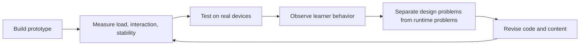
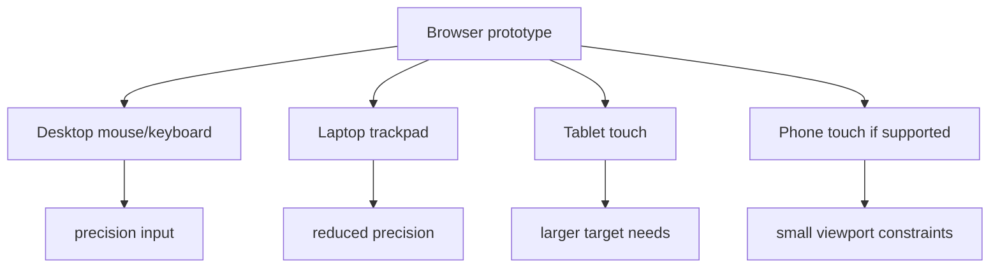

# Performance And Device Test Pack

  
Facilitator Handout 11

  
<strong>Module Focus:</strong> performance, device coverage, interaction reliability, and test planning for browser-based educational games and simulations

  
<strong>Best Use:</strong> use this handout when teams move from conceptually successful prototypes to systems that need to load, respond, and behave reliably across real devices and contexts

  
<strong>Atlas:</strong> <a href="/C:/Users/jewoo/Documents/Playground/educational-game-design-resource-pack-en/00-master-curriculum-atlas.md">Master Curriculum Atlas</a>

<table>
  <tr>
    <td style="background:#123B5D; color:#FFFFFF; padding:6px 10px;"><strong>[FRAME]</strong></td>
    <td style="background:#0F766E; color:#FFFFFF; padding:6px 10px;"><strong>[MAP]</strong></td>
    <td style="background:#A16207; color:#FFFFFF; padding:6px 10px;"><strong>[ACTION]</strong></td>
    <td style="background:#2F855A; color:#FFFFFF; padding:6px 10px;"><strong>[CHECK]</strong></td>
    <td style="background:#7C3AED; color:#FFFFFF; padding:6px 10px;"><strong>[EVIDENCE]</strong></td>
    <td style="background:#B42318; color:#FFFFFF; padding:6px 10px;"><strong>[RISK]</strong></td>
    <td style="background:#334155; color:#FFFFFF; padding:6px 10px;"><strong>[LINKS]</strong></td>
  </tr>
</table>

  <strong>Reliability Lens</strong> 
  In educational prototypes, performance is not only a technical quality issue. Slow load, delayed response, or unstable layout can distort learner attention, confidence, and the validity of your playtest evidence.

## [FRAME] Purpose

This handout helps teams test whether a browser-based learning game or simulation is:

- loading fast enough
- responding clearly enough
- stable enough across devices
- usable with different input modes
- trustworthy enough for formal playtesting

It is especially relevant for `Three.js`, canvas, or other interaction-heavy browser projects.

## [FRAME] Why Performance Is A Learning Issue

When a prototype stutters, delays, or misreads input, teams often misinterpret the results:

- learners appear confused when the interface is actually lagging
- learners appear unmotivated when load time is breaking momentum
- learners appear inaccurate when touch targets are unreliable

That means performance issues can contaminate both `engagement evidence` and `learning evidence`.

## [MAP] Performance Review Loop

## [MAP] Device And Input Coverage

## [ACTION] Core Web Vitals Baseline

The current `web.dev` guidance says that good user experience targets include:

- `LCP` within `2.5 seconds` or less
- `INP` of `200 milliseconds` or less
- `CLS` of `0.1` or less

Use these as orientation targets, not as the only definition of quality. Educational interactions may need additional checks around:

- asset-heavy scene load
- interaction feedback timing
- device-specific input accuracy

## [ACTION] Minimum Test Matrix

| Test Area | Minimum Coverage |
|---|---|
| browsers | one Chromium-based browser plus one alternate engine where feasible |
| devices | desktop or laptop plus one touch device if touch is supported |
| input | mouse, trackpad, and touch if relevant |
| network conditions | normal connection plus one slower condition if the audience may encounter it |
| viewport sizes | desktop and one smaller-screen layout |
| performance moments | initial load, first interaction, repeated interaction, scene transition |

## [ACTION] Device Test Template

| Device | Browser | Input Mode | Load Result | Interaction Result | Notes |
|---|---|---|---|---|---|
| laptop A | browser name | trackpad | pass/issue | pass/issue | notes |
| desktop B | browser name | mouse | pass/issue | pass/issue | notes |
| tablet C | browser name | touch | pass/issue | pass/issue | notes |

## [ACTION] What To Measure

### Loading

Check:

- time until meaningful content appears
- time until the first interactive action is possible
- whether large assets block early understanding

### Interactivity

Check:

- delay between action and visible response
- whether hover-only assumptions break touch use
- whether taps, clicks, and drags register consistently

### Visual Stability

Check:

- layout shift during loading
- moving buttons or overlays
- changes that cause accidental taps or misreads

### Input Reliability

Check:

- pointer precision expectations
- drag versus tap ambiguity
- small target failures on touch devices

## [ACTION] Pointer Events Review Questions

Use `Pointer Events` guidance when your interface should work across mouse, pen, and touch.

Ask:

- are we assuming mouse behavior where touch behavior differs?
- does the prototype require hover to discover essential information?
- what happens if the player cannot maintain precise continuous contact?
- are targets large enough for touch interaction?

## [EVIDENCE] Distinguishing Design Failure From Runtime Failure

| Observation | Possible Design Problem | Possible Runtime Problem |
|---|---|---|
| learner pauses before acting | unclear objective | slow first render or blocked input |
| learner misses buttons | weak visual hierarchy | layout shift or touch target issue |
| learner abandons task | low motivation | excessive load time |
| learner repeats action | unclear feedback | delayed response or dropped event |

## [ACTION] Pre-Playtest Gate

Do not run a formal or high-stakes playtest until the prototype can answer `yes` to all of these:

- does the main learning path load consistently
- does the first interaction work without hidden browser assumptions
- do targets remain stable while the page settles
- does the prototype behave acceptably on at least one realistic learner device
- can we tell whether confusion is conceptual rather than performance-related

## [RISK] Common Failure Modes

| Failure Mode | What It Looks Like | Why It Happens | Mitigation |
|---|---|---|---|
| desktop-only confidence | the prototype works well only on the creator’s machine | narrow test environment | require at least one lower-precision device test |
| touch afterthought | interactions rely on hover or tiny targets | mouse-first design habits | review Pointer Events assumptions early |
| asset overload | large media blocks initial meaning | polish is prioritized over usability | stage loading and reduce initial payload |
| misleading playtests | teams infer learning problems from runtime instability | design and performance evidence are mixed | add a technical smoke test before user sessions |
| late performance panic | issues appear only just before showcase | no recurring measurement loop | schedule lightweight checks each sprint |

## [ACTION] Mitigation Strategies

| If You Notice... | Then Do This |
|---|---|
| the prototype looks fine but feels slow | measure first interactive moment, not just page appearance |
| touch users struggle more than mouse users | enlarge targets and remove hover-only dependencies |
| layout moves under the learner | reserve space early and reduce late-loading UI shifts |
| large scenes delay meaning | load a simpler starter scene or placeholder state first |
| teams say “it works on my laptop” | require evidence from the minimum test matrix |

## [MAP] Concrete Performance Benchmarks for Educational Game Contexts

These benchmarks are specific to educational games — they differ from commercial game standards because the learner's goal is not entertainment but task completion under time constraints. Latency that is acceptable in a consumer game (2–3 seconds is "dramatic pause") is a UX failure in a learning context (2–3 seconds is lost attention).

### Loading Benchmarks

| Metric | Target | Acceptable | Fail |
|---|---|---|---|
| First Contentful Paint (FCP) | < 1.5 s | 1.5–3 s | > 3 s |
| Time to Interactive (TTI) | < 2.5 s | 2.5–4 s | > 4 s |
| First meaningful interaction (FMI) — learner can start play | < 4 s on school WiFi | 4–7 s | > 7 s |
| Scene transition (room to room, level to level) | < 500 ms | 500 ms–1.5 s | > 1.5 s |

**Why school WiFi matters.** The FMI benchmark is measured on a 5 Mbps connection, which is the median speed on school district WiFi in the United States (FCC 2023 data). Your laptop on a university connection is not the test condition. If you cannot simulate school WiFi, disable WiFi and use your phone as a 5G hotspot — then throttle to 5 Mbps in browser DevTools Network panel.

### Interaction Benchmarks

| Interaction type | Target response | Fail |
|---|---|---|
| Button tap / click (recognition response) | < 100 ms visual change | > 200 ms |
| Drag / slider (continuous input) | < 16 ms repaint (60 fps) | < 30 fps (visible stutter) |
| Feedback text appears after choice | < 300 ms | > 600 ms |
| Animation plays after event | < 100 ms start | > 300 ms start |
| Text loads in reading area | < 200 ms | > 400 ms |

**Why 100 ms matters.** Research on human motor-perceptual coupling (Card, Moran, Newell, 1983; Nielsen, 1993) established that responses faster than 100 ms feel instantaneous; responses between 100–300 ms feel slightly slow but acceptable; responses between 300 ms–1 s feel like a noticeable delay; responses over 1 s break the sense of causality between action and effect. In educational games, the learner must trace cause from their decision to the game's response — a response delay > 300 ms systematically degrades this tracing.

### Severity Decision Rules

Use these rules to determine whether to stop, flag, or proceed.

| Severity | Condition | Decision |
|---|---|---|
| **STOPPER** | FMI > 7 s on test connection, or any critical interaction (answer submit, core mechanic trigger) > 600 ms | Stop playtest. Fix before proceeding. |
| **HIGH** | FCP > 3 s, or scene transition > 1.5 s, or feedback text > 600 ms | Fix before the next planned playtest cycle. Do not let a HIGH issue persist across two revisions. |
| **MEDIUM** | Any interaction in the 200–600 ms range, visible layout shift, < 30 fps during active play | Log in revision backlog with effort estimate. Fix when HIGH issues are resolved. |
| **LOW** | Cosmetic delay (loading spinner not appearing, animation stutter on low-end device not in test matrix) | Log. Address if time permits. Do not block playtest. |

**Rule for STOPPER classification:** A STOPPER is any performance failure that would cause a target learner to stop engaging — not a performance failure that would bother a developer. Before classifying as STOPPER, ask: "Would a typical learner in the target context close the tab or put down the device because of this?" If yes: STOPPER. If no: HIGH or MEDIUM.

---

## [CHECK] Critical Thinking Prompts

- What learner behavior in our playtest could actually be a performance artifact?
- Which device in our expected audience is least likely to succeed right now?
- What is the smallest runtime improvement that would most improve educational validity?
- Are we measuring the moment the page appears, or the moment meaningful learning interaction begins?
- What assumption about input precision is built into this prototype?

## [LINKS] Official References

- Learn Core Web Vitals: [https://web.dev/explore/learn-core-web-vitals](https://web.dev/explore/learn-core-web-vitals)
- Web Vitals article: [https://web.dev/articles/vitals](https://web.dev/articles/vitals)
- Web performance overview: [https://web.dev/performance/](https://web.dev/performance/)
- MDN Pointer Events: [https://developer.mozilla.org/en-US/docs/Web/API/Pointer_events](https://developer.mozilla.org/en-US/docs/Web/API/Pointer_events)

## [LINKS] Internal Navigation

- [05-threejs-foundations-learning-pack.md](</C:/Users/jewoo/Documents/Playground/educational-game-design-resource-pack-en/05-threejs-foundations-learning-pack.md>)
- [06-technical-qa-and-data-logging-checklists.md](</C:/Users/jewoo/Documents/Playground/educational-game-design-resource-pack-en/06-technical-qa-and-data-logging-checklists.md>)
- [00-master-curriculum-atlas.md](</C:/Users/jewoo/Documents/Playground/educational-game-design-resource-pack-en/00-master-curriculum-atlas.md>)
