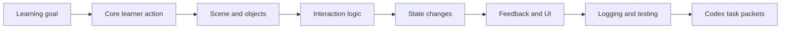
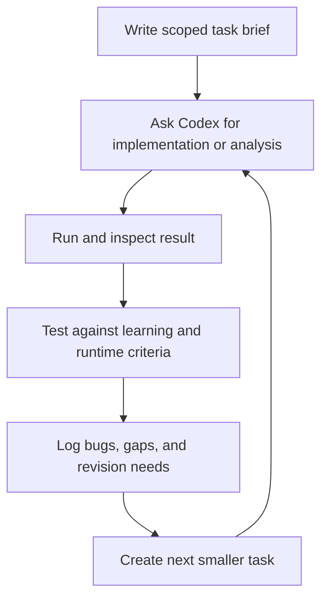

# Codex-To-Three.js Build Playbook

<div style="border:2px solid #1F4DB8; background:#F4F7FF; padding:18px; border-radius:10px; margin:12px 0;">
  <div style="font-size:22px; font-weight:700; color:#1F4DB8;">Facilitator Handout 12</div>
  <div style="margin-top:8px;"><strong>Module Focus:</strong> turning educational design documents into Codex-ready build tasks and a disciplined Three.js prototype workflow</div>
  <div><strong>Best Use:</strong> use this handout when teams are ready to move from concept, maps, and interaction plans into guided implementation, debugging, and iteration with Codex and Three.js</div>
  <div><strong>Atlas:</strong> <a href="/C:/Users/jewoo/Documents/Playground/educational-game-design-resource-pack-en/00-master-curriculum-atlas.md">Master Curriculum Atlas</a></div>
</div>

<table>
  <tr>
    <td style="background:#123B5D; color:#FFFFFF; padding:6px 10px;"><strong>[FRAME]</strong></td>
    <td style="background:#0F766E; color:#FFFFFF; padding:6px 10px;"><strong>[MAP]</strong></td>
    <td style="background:#A16207; color:#FFFFFF; padding:6px 10px;"><strong>[ACTION]</strong></td>
    <td style="background:#2F855A; color:#FFFFFF; padding:6px 10px;"><strong>[CHECK]</strong></td>
    <td style="background:#7C3AED; color:#FFFFFF; padding:6px 10px;"><strong>[EVIDENCE]</strong></td>
    <td style="background:#B42318; color:#FFFFFF; padding:6px 10px;"><strong>[RISK]</strong></td>
    <td style="background:#334155; color:#FFFFFF; padding:6px 10px;"><strong>[LINKS]</strong></td>
  </tr>
</table>

<div style="border-left:4px solid #1F4DB8; background:#F8FAFF; padding:12px 14px; margin:14px 0;">
  <strong>Build Lens</strong><br/>
  Codex is most valuable when the team has already clarified the learning loop, the scene logic, and the scope boundary. The better the build brief, the better the implementation and the easier the debugging.
</div>

## [FRAME] Purpose

This handout helps teams use `Codex` well when building a `Three.js` educational prototype. It is not a generic AI prompt sheet. It is a workflow guide for:

- translating design intent into build tasks
- reducing overbuilding
- structuring implementation around scene, object, state, and feedback logic
- keeping debugging evidence visible
- deciding what should be built now versus later

## [FRAME] Why This Playbook Matters

Teams moving into implementation often fail in one of three ways:

- they start coding before the learning loop is stable
- they ask Codex for a full game instead of a bounded prototype slice
- they confuse visible 3D output with validated learning design

This playbook is meant to keep the build process disciplined.

## [MAP] Design-To-Build Translation



## [MAP] Codex Build Loop



## [ACTION] What Must Exist Before Building

Before assigning work to Codex, require:

- a one-sentence learning goal
- a one-sentence player goal
- a named smallest playable loop
- a scene or interface sketch
- a list of interactive objects
- a list of state changes
- a definition of what counts as “good enough” for this milestone

If these are missing, the team is not ready to build. They are ready only to brainstorm.

## [ACTION] The Minimal Build Packet

Every Codex request should ideally include:

| Element | What To Include |
|---|---|
| objective | what this build task should accomplish |
| scope boundary | what is explicitly out of scope |
| files or modules | where the change should likely happen |
| current behavior | what exists now |
| target behavior | what should change |
| test expectation | how success will be checked |
| design rationale | why this behavior matters educationally |

## [ACTION] Scene-Object-State Checklist

Use this before implementation.

| Category | Questions |
|---|---|
| scene | what is visible at start, what is hidden, what changes over time |
| camera | what should be seen first, what should remain legible |
| objects | which meshes or groups are decorative, informative, or interactive |
| interaction | what input acts on which object and with what feedback |
| state | what variables change when the learner succeeds, fails, or explores |
| UI | what information should stay in HUD versus in-world |
| evidence | what actions should be logged for debugging or learning analysis |

## [ACTION] Task Types That Work Well With Codex

Good task shapes:

- create a basic scene with named objects and placeholder geometry
- add raycast interaction to specific objects
- wire one learner action to one visible state change
- implement a simple HUD status message
- add a structured logging utility for core events
- fix a specific interaction bug with reproduction steps

Weak task shapes:

- build the whole game
- make it fun
- add all features we discussed
- turn this into a polished simulation

## [ACTION] Prompt Contract Template

Use a structure like this when asking Codex to build:

```text
Goal:
Build one bounded Three.js prototype slice for [learning purpose].

Current state:
[What exists already.]

Target behavior:
[What should happen.]

Constraints:
- Keep scope to [single loop / single scene / single mechanic].
- Use placeholder assets if needed.
- Do not add extra systems not required for this task.

Success criteria:
- [Criterion 1]
- [Criterion 2]
- [Criterion 3]

Out of scope:
- [List]
```

## [ACTION] Definition Of Done For A Prototype Slice

| Area | Done Means |
|---|---|
| behavior | the intended interaction works consistently |
| clarity | the learner can tell what changed and why |
| scope | no unrelated systems were added |
| runtime | the slice runs without obvious blocking issues |
| evidence | success and failure conditions can be observed or logged |
| reviewability | another team member can explain the code and behavior |

## [ACTION] Bug Report Template For Codex Iteration

```text
Bug title:

Expected behavior:

Actual behavior:

Steps to reproduce:
1.
2.
3.

Where it happens:

Possible cause if known:

What to preserve:

What not to change:
```

## [FRAME] API Planning Note

If teams later build agent workflows programmatically, OpenAI’s current documentation points developers toward the `Responses API` as the future direction for agentic applications. The same migration guide states that the `Assistants API` was deprecated on `August 26, 2025` with a sunset date of `August 26, 2026`.

Inference:

For any forward-looking build curriculum, it is more durable to teach `Responses API` concepts rather than designing new instructional examples around the legacy Assistants pattern.

## [RISK] Common Failure Modes

| Failure Mode | What It Looks Like | Why It Happens | Mitigation |
|---|---|---|---|
| prompt bloat | the task brief is long but not scoped | teams include every idea at once | require one prototype slice per request |
| 3D prestige trap | 3D scenes expand without adding instructional value | ambition outruns learning logic | restate the learning goal before every major build step |
| invisible done criteria | Codex produces code, but nobody knows if it solved the right problem | no success criteria were written | require a definition of done before coding |
| debugging without reproduction | teams say “it broke” without steps | runtime observation is weak | use a fixed bug report template |
| AI dependency without understanding | the build advances but the team cannot explain it | review and reflection are skipped | require code walk-throughs and behavior explanations |

## [ACTION] Mitigation Strategies

| If You Notice... | Then Do This |
|---|---|
| Codex output keeps expanding scope | interrupt and rewrite the task as a smaller brief |
| the prototype looks impressive but teaches little | compare the build directly against the learner action and evidence plan |
| teams cannot review generated code | pause new generation work until they can explain the current slice |
| bug fixing turns chaotic | isolate one bug at a time with reproduction steps |
| teams want to add polished assets too early | keep placeholder assets until the interaction loop is validated |

## [CHECK] Critical Thinking Prompts

- What is the smallest build step that would actually reduce uncertainty right now?
- Which part of this requested feature is educationally necessary, and which part is aesthetic ambition?
- If Codex completed this task perfectly, what new question would still remain unanswered?
- Are we building a prototype to learn, or a product to impress?
- What would we lose if we forced ourselves to ship only one scene and one mechanic this week?

## [LINKS] Official References

- Introducing Codex: [https://openai.com/index/introducing-codex/](https://openai.com/index/introducing-codex/)
- Codex product page: [https://openai.com/codex](https://openai.com/codex)
- Introducing the Codex app: [https://openai.com/index/introducing-the-codex-app/](https://openai.com/index/introducing-the-codex-app/)
- New tools and features in the Responses API: [https://openai.com/index/new-tools-and-features-in-the-responses-api/](https://openai.com/index/new-tools-and-features-in-the-responses-api/)
- Responses API tools guide: [https://platform.openai.com/docs/guides/tools?api-mode=responses](https://platform.openai.com/docs/guides/tools?api-mode=responses)
- Migrate to the Responses API: [https://platform.openai.com/docs/guides/migrate-to-responses](https://platform.openai.com/docs/guides/migrate-to-responses)
- three.js Creating a Scene: [https://threejs.org/manual/en/creating-a-scene.html](https://threejs.org/manual/en/creating-a-scene.html)
- three.js Picking: [https://threejs.org/manual/en/picking.html](https://threejs.org/manual/en/picking.html)
- three.js Loading a .GLTF File: [https://threejs.org/manual/en/load-gltf.html](https://threejs.org/manual/en/load-gltf.html)

## [LINKS] Internal Navigation

- [05-threejs-foundations-learning-pack.md](</C:/Users/jewoo/Documents/Playground/educational-game-design-resource-pack-en/05-threejs-foundations-learning-pack.md>)
- [11-performance-and-device-test-pack.md](</C:/Users/jewoo/Documents/Playground/educational-game-design-resource-pack-en/11-performance-and-device-test-pack.md>)
- [00-master-curriculum-atlas.md](</C:/Users/jewoo/Documents/Playground/educational-game-design-resource-pack-en/00-master-curriculum-atlas.md>)
